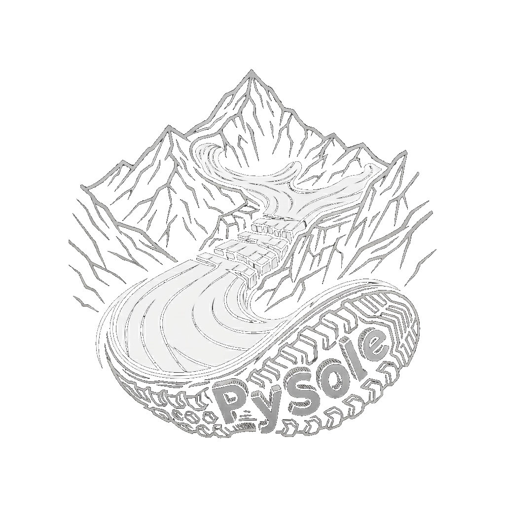

<p align="center">
  
</p>
<p style="text-align: center; font-size: 20px;"><strong>Physically-Informed Bedrock Interpolation & 3D Migration for Sparse Geophysical Datasets</strong></p>

`PySole` is designed to reconstruct the thickness distribution and basal topography (sole) of glaciers, landslides, and other gravity-driven, viscous flow phenomena. It adapts the **Shallow Ice Approximation** to estimate the thickness distribution based on the fundamental inverse relation between surface slope and depth - where gentler surface slopes corrspond to greater depths, and vice versa. It is specifically engineered for sparse geophysical datasets where 3D wavefield migration to image the bedrock is impossible due to insufficient spatial sampling. `PySole` transforms limited survey points into robust, physically-constrained 3D bedrock models.

---

## Table of Contents

[Key Features](#key-features)<br><br>
[Workflow & Methodology](#workflow-and-methodology)<br><br>
[Installation](#installation)<br><br>
[Configuration Guide (`pysole.json`)](#configuration-guide)<br><br>
[Configuration Parameter Reference](#configuration-parameter-reference)<br><br>
[Technical & Methodological Notes](#technical-and-methodological-notes)<br>
&nbsp;&nbsp;&nbsp;&nbsp;[1. Supported DEM Input Formats](#supported-dem-input-formats)<br>
&nbsp;&nbsp;&nbsp;&nbsp;[2. Rock Outcrops & Nunatak Hole Detection](#rock-outcrops-and-nunatak-hole-detection)<br>
&nbsp;&nbsp;&nbsp;&nbsp;[3. Shallow Ice Approximation Drift Model](#shallow-ice-approximation-custom-drift)<br>
&nbsp;&nbsp;&nbsp;&nbsp;[4. Spatial Smoothing of the Calculated DEMs](#dem-spatial-smoothing)<br>
&nbsp;&nbsp;&nbsp;&nbsp;[5. Depth Uncertainty Derivation](#depth-uncertainty-derivation)<br>
&nbsp;&nbsp;&nbsp;&nbsp;[6. Multi-Format Bedrock Output Export](#multi-format-bedrock-output-export)<br><br>
[Package Architecture](#package-architecture)<br><br>
[Python API & Quick Start](#python-api-and-quick-start)<br><br>
[Real-World Example: Wurtenkees Glacier](#real-world-example-wurtenkees-glacier)<br><br>
[Citation & References](#citation-and-references)

---

<a id="key-features"></a>
## Key Features

* **JSON Configuration Driven:** All required and optional input and output parameters can be fully defined in a single `pysole.json` file.
* **Automated High-Resolution Diagnostic Plots:** Automatically generates and optionally exports diagnostic figures for each key processing milestone.
* **5 Supported Digital Elevation Model (DEM) Input Formats:** Seamless loading and metadata extraction for GeoTIFF (`.tif`), ESRI ASCII Grid (`.asc`, `.txt`), CSV matrix (`.csv`), NumPy binary array (`.npy`), and in-memory NumPy 2D array (`np.ndarray`).
* **Strict CRS & Spatial Alignment Verification:** Performs strict verification across all input layers (DEM, boundary outline, survey points). If any layer uses a different Coordinate Reference System or falls outside the DEM spatial extent, processing halts with an explicit error.
* **Rock Outcrop & Nunatak Hole Support:** Native parsing of interior vector polygon holes. When boundary conditions are enabled, zero-traveltime/-thickness constraints are automatically applied along internal hole perimeters.
* **Flexible Survey Data Types:** `PySole` accepts one- or two-way signal traveltimes as well as direct thickness/depth measurements as survey data type. In case of direct thickness/depth data the 3D ray-based migration is automatically skipped.
* **DEM Surface Slope Smoothing:** The degree of DEM surface slope smoothing is crucial when estimating thickness with the Shallow Ice Approximation (SIA). By adapting the SIA, Binder et al. (2009) introduced an objective optimization criterion for the surface slope smoothing process, which is implemented in `PySole`. The optimal degree of DEM surface slope smoothing is derived by enforcing the optimization criterion of minimum spatial variance in basal shear stress:
  <p align="center">
    <font size="+1"><b>min<sub><i>k</i><sub>c</sub></sub> Var<sub><i>xy</i></sub>(<i>τ</i><sub>b</sub>)</b></font>
  </p>

  In shallow ice dynamics, basal shear stress is given by:

  <p align="center">
    <font size="+1"><b>τ<sub>b</sub> = ρ<sub>ice</sub> g D sin(α)</b></font>
  </p>

  where ice density, <i>ρ</i><sub>ice</sub>, and gravitational acceleration, <i>g</i>, are assumed to be constant. Thus, just the product of ice depth and surface slope, <i>P</i> = <i>D</i> sin(<i>α</i>), is evaluated during the optimization process. Surface slope smoothing is performed in the frequency domain, while spatial variance is quantified via variogram analysis. An interactive mode allows users to test varying degrees of smoothing across spatial wavenumber cutoffs (<i>k</i><sub>c</sub>) and refine the variogram correlation range. This surface slope optimization methodology is an integral component for interpolating both pre-migration wavefront traveltimes and post-migration depths.
* **3D Ray-Based Migration:** `PySole` features an optional 3D ray-based migration—introduced by Binder et al. (2009) and engineered specifically to process geophysical signal traveltimes with sparse spatial coverage.
* **Three Kriging Interpolation Approaches & Boundary Condition:** `PySole` leverages the [`PyKrige`](https://geostat-framework.readthedocs.io/projects/pykrige) package to provide 2D Universal Kriging (default), 2D Ordinary Kriging, and 2D Regression Kriging. The default Universal Kriging drift model uses a quadratic polynomial; additionally, a custom physical drift based on the SIA is implemented. Zero traveltime (<i>T</i> = 0 s) and zero thickness (<i>D</i> = 0 m) along the perimeter boundary can optionally be enforced as boundary condition. Corresponding Kriging interpolation uncertainty fields are calculated.
* **ML Hole Filling & Geomorphological Margin Blending:** Employs [`scikit-learn`](https://scikit-learn.org) Random Forest regression to patch blank regions and ensure complete spatial coverage after Kriging interpolation (optional step). Furthermore, geomorphological margin blending can be applied to smoothly taper bedrock elevations into the surrounding surface DEM terrain.
* **Final DEMs Spatial Smoothing:** As a post-processing step, spatial smoothing options are available for the calculated depth and bedrock DEMs.
* **Multi-Format Output Export:** Export final bedrock elevation maps as GeoTIFF (`.tif`), ESRI ASCII Grid (`.asc`), CSV (`.csv`), NumPy (`.npy`), or all four formats simultaneously.

---

<a id="workflow-and-methodology"></a>
## Workflow & Methodology

<p align="center">
  <a href="images/pysole_processing_pipeline.png">
    
  </a>
  <br>
  <em>Figure 1:  End-to-end computational workflow of the PySole solver processing pipeline. Click diagram to view in high resolution.</em>
</p>

1. **DEM Loading & Spatial Resampling:** Grid spacing (`dx`, `dy`) and bounding extent are automatically extracted from DEM metadata. If target `dx` and `dy` pixel sizes are specified, 2D bilinear grid resampling is performed automatically.
2. **Pre-Migration Traveltime Interpolation:** Applies the optimization criterion to determine the optimal surface slope smoothing degree by evaluating the product of traveltime observations and corresponding smoothed surface slopes, <i>P</i><sub>T,i</sub> = <i>T</i><sub>i</sub> sin(<i>α</i><sub>smoothed,i</sub>). Once the optimal smoothing degree is determined, `PySole` interpolates <i>P</i><sub>T,i</sub> using Kriging (with optional zero-traveltime boundary conditions <i>T</i> = 0 s) to receive the continuous product field <i>P</i><sub>T</sub>(<i>x</i>,<i>y</i>). The continuous signal traveltime field <i>T</i>(<i>x</i>,<i>y</i>) is ultimately reconstructed by dividing <i>P</i><sub>T</sub>(<i>x</i>,<i>y</i>) by the optimal smoothed surface slope field, sin(<i>α</i><sub>opt</sub>(<i>x</i>,<i>y</i>)). A minimum smoothed surface slope threshold of 2.0° is enforced to prevent numerical instabilities and unphysical singularities in low-gradient regions.
3. **3D Ray-Based Migration:** The migration algorithm solves the Eikonal equation to relocate subsurface reflection points. An interactive mode allows users to test different signal propagation velocities and evaluate them through visualizations of migrated depths and the corresponding horizontal survey point displacements induced by the migration process.
4. **Post-Migration Surface Slope Optimization:** Analogous to the pre-migration interpolation step, `PySole` applies the optimization criterion to determine the optimal surface slope smoothing degree, sin(<i>α</i><sub>opt</sub>), across spatial wavenumber cutoffs <i>k</i><sub>c</sub>. In this second optimization pass the product of migrated depths (<i>D</i><sub>i</sub>) and the corresponding smoothed surface slopes, <i>P</i><sub>D,i</sub> = <i>D</i><sub>i</sub> sin(<i>α</i><sub>smoothed,i</sub>), is evaluated.
5. **Final Depth Interpolation & Uncertainty Display:** Performs spatial Kriging interpolation on the products <i>P</i><sub>D,i</sub> = <i>D</i><sub>i</sub> sin(<i>α</i><sub>opt,i</sub>) to reconstruct continuous depth <i>D</i>(<i>x</i>,<i>y</i>) and bedrock elevation <i>Z</i><sub>bed</sub>(<i>x</i>,<i>y</i>) fields. The Kriging standard error for the interpolated depths is converted to meters to quantify depth uncertainty.

---

<a id="installation"></a>
## Installation

### Standard Installation via PyPI <strong><i> -> !!! NOT AVAILABLE YET !!!</i></strong>

```bash
pip install pysole
```

### Local / Development Installation

To install `PySole` directly from source in editable mode:

```bash
git clone https://github.com/da0bi/pysole.git
cd pysole
pip install -e .
```

Or using `uv`:

```bash
uv pip install -e .
```

---

<a id="configuration-guide"></a>
## Configuration Guide (`pysole.json`)

All execution options can be fully defined in a single `pysole.json` configuration file:

```json
{
    "inputs": {
        "dem_path": "surface_dem.asc",
        "outline_path": "creeping_body.shp",
        "survey_data_path": "sparse_survey.csv",
        "survey_data_type": "one_way_travel_time"
    },
    "spatial_parameters": {
        "dx": 5.0,
        "dy": 5.0,
        "bounds": null
    },
    "migration_parameters": {
        "perform_migration": true,
        "velocity": 0.16,
        "interactive_migration": false
    },
    "optimization_parameters": {
        "kc_max": 10.0,
        "kc_min": 0.01,
        "d_kc": 0.1,
        "num_steps": 10,
        "interactive_optimization": false
    },
    "kriging_parameters": {
        "pre_migration": {
            "method": "universal",
            "drift_terms": ["quadratic"],
            "variogram_model": "spherical",
            "include_zero_boundary_condition": false
        },
        "post_migration": {
            "method": "universal",
            "drift_terms": ["sia_thickness"],
            "variogram_model": "spherical",
            "include_zero_boundary_condition": true
        }
    },
    "finalization_parameters": {
        "random_forest_gap_filling": false,
        "apply_margin_blend": false,
        "min_gap_dist": 50.0,
        "smooth_bedrock": false,
        "smoothing_method": "gaussian",
        "smoothing_sigma": 1.5,
        "smoothing_kernel_size": 3,
        "smoothing_kc_cutoff": null
    },
    "outputs": {
        "output_path": "final_bedrock.tif",
        "output_format": "tif",
        "plots_dir": null
    }
}
```

---

<a id="configuration-parameter-reference"></a>
## Configuration Parameter Reference

| Section | Parameter | Type | Default | Description |
| :--- | :--- | :--- | :--- | :--- |
| **`inputs`** | `dem_path` | `str` | `"surface_dem.asc"` | **(Required)** File path to the surface Digital Elevation Model (`.asc`, `.tif`, `.csv`, `.npy`). |
| | `outline_path` | `str` | `"creeping_body.shp"` | File path to creeping body / glacier boundary polygon (`.shp`, `.geojson`, `.gpkg`, `.csv`). CRS must match DEM. |
| | `survey_data_path` | `str` | `"sparse_survey.csv"` | **(Required)** File path to survey profile travel time or thickness observations CSV `[X, Y, value]`. |
| | `survey_data_type` | `str` | `"one_way_travel_time"` | Observation data type: `"one_way_travel_time"` (OWT), `"two_way_travel_time"` (TWT), or `"thickness"` / `"ice_thickness"` (skips ray migration). |
| **`spatial_parameters`** | `dx` | `float` | `null` | Target grid resolution along X in meters. If defined, automatically resamples the DEM grid. If `null`, native resolution is kept. |
| | `dy` | `float` | `null` | Target grid resolution along Y in meters. If defined, automatically resamples the DEM grid. If `null`, native resolution is kept. |
| | `bounds` | `list[float]` | `null` | Spatial bounding box `[minx, miny, maxx, maxy]`. If `null`, extracted directly from DEM raster metadata. |
| **`migration_parameters`** | `perform_migration` | `bool` | `true` | If `true`, performs 3D Eikonal ray migration on travel times. If `false`, migration is cleanly skipped. |
| | `velocity` | `float` | `0.16` | Signal propagation velocity in m/ns (e.g. `0.16` m/ns for GPR radar wave propagation in ice). |
| | `interactive_migration` | `bool` | `false` | If `true`, enables interactive velocity testing with visual displacement vector plots. |
| **`optimization_parameters`** | `kc_max` | `float` | `10.0` | Maximum corner frequency for FFT Gaussian low-pass smoothing. If `null`, defaults to `10.0`. |
| | `kc_min` | `float` | `0.01` | Minimum corner frequency for slope smoothing search. |
| | `d_kc` | `float` | `0.1` | Corner frequency stepwidth for evaluating basal shear stress spatial variance Var<sub><i>xy</i></sub>(<i>τ</i><sub>b</sub>). |
| | `num_steps` | `int` | `10` | Number of evaluation steps if `d_kc` is not specified. |
| | `interactive_optimization` | `bool` | `false` | If `true`, enables interactive CLI prompt to inspect BSS variance curve and enter a custom correlation range (<i>a</i><sub>range</sub>). |
| **`kriging_parameters`** | `pre_migration` | `dict` | *Sub-section* | Configuration for 1st-pass pre-migration traveltime interpolation (<i>T</i>(<i>x</i>,<i>y</i>) [ns]). |
| | `pre_migration.method` | `str` | `"universal"` | Kriging approach: `"universal"` (default), `"ordinary"`, or `"regression"`. |
| | `pre_migration.drift_terms` | `list[str]` | `["quadratic"]` | Drift terms for Universal Kriging: `["quadratic"]` (2nd-order polynomial), `["regional_linear"]`, or `["sia_thickness"]`. |
| | `pre_migration.variogram_model` | `str` | `"spherical"` | Theoretical variogram model (`"spherical"`, `"exponential"`, `"gaussian"`, `"linear"`). |
| | `pre_migration.include_zero_boundary_condition` | `bool` | `false` | If `true`, includes zero traveltime boundary points (<i>T</i> = 0 ns) along the margin outline. |
| | `post_migration` | `dict` | *Sub-section* | Configuration for 2nd-pass post-migration final bedrock depth interpolation (<i>D</i>(<i>x</i>,<i>y</i>) [m]). |
| | `post_migration.method` | `str` | `"universal"` | Kriging approach: `"universal"` (default), `"ordinary"`, or `"regression"`. |
| | `post_migration.drift_terms` | `list[str]` | `["sia_thickness"]` | Drift terms for Universal Kriging: `["sia_thickness"]` (SIA physical drift <i>U</i><sub>SIA</sub> = 1 / sin(<i>α</i><sub>safe</sub>)), `["quadratic"]`, or `["regional_linear"]`. |
| | `post_migration.variogram_model` | `str` | `"spherical"` | Theoretical variogram model (`"spherical"`, `"exponential"`, `"gaussian"`, `"linear"`). |
| | `post_migration.include_zero_boundary_condition` | `bool` | `true` | If `true` (default), includes zero thickness boundary points (<i>D</i> = 0 m) along the margin outline. |
| **`finalization_parameters`** | `random_forest_gap_filling` | `bool` | `false` | If `true`, applies Random Forest machine learning gap filling across unmeasured interior regions before margin blending. |
| | `apply_margin_blend` | `bool` | `false` | If `true`, applies geomorphological margin blending to seamlessly transition bedrock elevation to surrounding DEM terrain. |
| | `min_gap_dist` | `float` | `50.0` | Minimum gap distance / margin width in meters [m] inside which bedrock is smoothly tapered and blended into surface DEM terrain. |
| | `smooth_bedrock` | `bool` | `false` | If `true`, applies spatial DEM post-processing smoothing directly to the ice depth field <i>D</i>(<i>x</i>,<i>y</i>) to eliminate high-frequency slope-division noise. |
| | `smoothing_method` | `str` | `"gaussian"` | DEM smoothing algorithm choice: `"gaussian"` (default), `"median"`, or `"fft_lowpass"`. |
| | `smoothing_sigma` | `float` | `1.5` | Standard deviation (<i>σ</i>) of the Gaussian kernel in grid units (for `"gaussian"`). |
| | `smoothing_kernel_size` | `int` | `3` | Window kernel size (<i>k</i> × <i>k</i>) for median filtering (must be an odd integer, for `"median"`). |
| | `smoothing_kc_cutoff` | `float` | `null` | Corner frequency cutoff wavenumber (<i>k</i><sub>c,smooth</sub>) for `"fft_lowpass"`. If `null`, defaults to <i>k</i><sub>c,opt</sub>. |
| **`outputs`** | `output_path` | `str` | `"final_bedrock.tif"` | Target file path or base name for exporting the final predicted bedrock elevation raster. |
| | `output_format` | `str` / `list[str]` | `"tif"` | Desired export format(s): `"tif"`, `"asc"`, `"csv"`, `"npy"`, a list of formats (e.g. `["tif", "asc", "csv"]`), or `"all"` to export all four formats. |
| | `plots_dir` | `str` | `null` | Optional target directory where generated diagnostic figures and map plots are saved at high resolution (300 DPI). If `null`, plot saving is disabled. |

---

<a id="technical-and-methodological-notes"></a>
## Technical & Methodological Notes

<a id="supported-dem-input-formats"></a>
### 1. Supported DEM Input Formats
`PySole` supports 5 distinct DEM input formats in `load_dem()`:

- **GeoTIFF (`.tif`, `.tiff`, `.geotiff`)**: *Recommended*. Automatically extracts spatial bounds, transform, CRS, pixel resolution, and `nodata` values using [`rasterio`](https://rasterio.readthedocs.io).
- **ESRI ASCII Grid (`.asc`, `.txt`)**: Standard 6-line header GIS raster format. Automatically extracts `ncols`, `nrows`, `xllcorner`, `yllcorner`, `cellsize`, and `NODATA_value`.
- **CSV Matrix (`.csv`)**: 2D comma-separated matrix of elevation values.
- **NumPy Binary Array (`.npy`)**: Fast 2D binary array loaded via `np.load()`.
- **NumPy 2D Array (`np.ndarray`)**: Direct in-memory array passed into the `Solver` constructor (`dem=dem_grid`).

<a id="rock-outcrops-and-nunatak-hole-detection"></a>
### 2. Rock Outcrops & Nunatak Hole Detection
Vector polygon files (`.shp`, `.geojson`, `.gpkg`) or CSV outline files containing interior rings (separated by `NaN` rows) are automatically parsed as polygon holes. `PySole` treats pixels inside rock outcrop holes as exposed bedrock (<i>D</i> = 0 m).

For rock outcrop holes to be detected correctly from a Shapefile (`.shp`):

- **Topology**: The outcrop must be stored as an interior ring (`polygon.interiors`) within a single `Polygon` / `MultiPolygon` feature (e.g. created using QGIS "Add Ring" or ArcGIS "Construct Hole").
- **Winding Order**: Standard OGC orientation (Clockwise exterior boundary, Counter-Clockwise interior hole rings).
- **CRS Alignment**: The shapefile's Coordinate Reference System must match the DEM raster projection.
- **Valid Geometries**: Rings must not intersect themselves (`PySole` automatically executes `validate_and_extract_polygons()` on load to auto-repair geometries or fall back to the outer boundary shell if holes fail criteria).

<a id="shallow-ice-approximation-custom-drift"></a>
### 3. Shallow Ice Approximation Drift Model for Universal Kriging Interpolation
`PySole` offers a physically-informed custom drift model based on the **Shallow Ice Approximation (SIA)**. Re-arranging the basal shear stress <i>τ</i><sub>b</sub> for ice depth <i>D</i> yields the inverse relationship between <i>D</i>(<i>x</i>,<i>y</i>) and sin(<i>α</i>(<i>x</i>,<i>y</i>)). Setting `"drift_terms": ["sia_thickness"]` informs Universal Kriging of the **relative thickness distribution pattern** driven directly by the optimized DEM surface slope:

  <p align="center">
    <font>D &prop; sin(<i>α</i><sub>opt</sub>(<i>x</i>,<i>y</i>))<sup>-1</sup></font>
  </p>

Thus, producing a terrain-conforming, physically realistic background trend across unmeasured gap regions without requiring assumptions about absolute <i>τ</i><sub>b</sub> values. The custom physical SIA drift model is available for both pre- and post-migration Universal Kriging interpolations, and is used by default for the final interpolation of migrated depth data.

<a id="dem-spatial-smoothing"></a>
### 4. Spatial Smoothing of the Calculated Depth and Bedrock DEMs
In product-kriging, depth is obtained by dividing the Kriged product field <i>P</i><sub>D</sub>(<i>x</i>,<i>y</i>) with the optimal smoothed surface slope field sin(<i>α</i><sub>opt</sub>(<i>x</i>,<i>y</i>)). When post-processing DEM spatial smoothing is enabled (`smooth_bedrock: true`), `PySole` applies the spatial smoothing operator <i>S</i> **directly to the ice depth field <i>D</i>(<i>x</i>,<i>y</i>)**:

<p align="center" style="line-height: 1.8;">
  <i>D</i><sub>smooth</sub>(<i>x</i>,<i>y</i>) = <i>S</i>(<i>D</i>(<i>x</i>,<i>y</i>))<br>
  <i>Z</i><sub>bed</sub>(<i>x</i>,<i>y</i>) = <i>Z</i><sub>surface</sub>(<i>x</i>,<i>y</i>) − <i>D</i><sub>smooth</sub>(<i>x</i>,<i>y</i>)
</p>

Applying smoothing directly to <i>D</i>(<i>x</i>,<i>y</i>) prevents the high-frequency surface DEM roughness residual (<i>Z</i><sub>surface</sub> − <i>S</i>(<i>Z</i><sub>surface</sub>)) from superimposing rectangular grid artifacts onto the ice thickness map, ensuring that both <i>D</i>(<i>x</i>,<i>y</i>) and <i>Z</i><sub>bed</sub>(<i>x</i>,<i>y</i>) remain smooth and continuous. The available spatial smoothing operators are `"gaussian"`, `"median"`, and `"fft_lowpass"`.

<a id="depth-uncertainty-derivation"></a>
### 5. Depth Uncertainty Derivation in Meters
Kriging interpolation provides uncertainty estimates by variance of the product field <i>σ</i><sub>P</sub><sup>2</sup>(<i>x</i>,<i>y</i>) [m<sup>2</sup>]. The 2D depth estimation variance field <i>σ</i><sub>D</sub><sup>2</sup>(<i>x</i>,<i>y</i>) [m<sup>2</sup>] is obtained via linear error propagation:

<p align="center">
  <i>σ</i><sub>D</sub><sup>2</sup>(<i>x</i>,<i>y</i>) = <i>σ</i><sub>P</sub><sup>2</sup>(<i>x</i>,<i>y</i>) / sin<sup>2</sup>(<i>α</i><sub>opt</sub>(<i>x</i>,<i>y</i>)) &nbsp;&nbsp; [m<sup>2</sup>]
</p>

Taking the square root converts the variance field into the **Kriging Standard Error <i>σ</i><sub>D</sub>(<i>x</i>,<i>y</i>) in ± meters**:

<p align="center">
  <i>σ</i><sub>D</sub>(<i>x</i>,<i>y</i>) = √(<i>σ</i><sub>D</sub><sup>2</sup>(<i>x</i>,<i>y</i>)) &nbsp;&nbsp; [± m]
</p>

Under Gaussian linear estimation theory, ± 1.00 <i>σ</i><sub>D</sub>(<i>x</i>,<i>y</i>) represents the 68.3% confidence margin of error, while ± 1.96 <i>σ</i><sub>D</sub>(<i>x</i>,<i>y</i>) represents the 95% confidence margin of error.

<a id="multi-format-bedrock-output-export"></a>
### 6. Multi-Format Bedrock Output Export
Under `outputs` in `pysole.json`, users can specify which file format(s) to export via `output_format`:<br><br>
&nbsp;&nbsp;&nbsp;&nbsp;`"output_format": "tif" (or "asc", "csv", "npy")`: Exports a single specified format.<br>
&nbsp;&nbsp;&nbsp;&nbsp;`"output_format": ["tif", "asc", "csv", "npy"]`: Exports a list of specified formats.<br>
&nbsp;&nbsp;&nbsp;&nbsp;`"output_format": "all"`: Exports all four formats simultaneously.

---

<a id="package-architecture"></a>
## Package Architecture

<p align="center">
  <a href="images/pysole_package_structure.png">
    
  </a>
  <br>
  <em>Figure 2: Overview of PySole package submodules, class structure, and core processing functions. Solver functions and related submodules are color-coded. Click diagram to view in high resolution.</em>
</p>

<a id="python-api-and-quick-start"></a>

---

## Python API & Quick Start

Run the complete pipeline from a `pysole.json` file in a single line:

```python
import pysole

# Execute complete workflow defined in pysole.json
bedrock_map = pysole.run_from_config("pysole.json")
```

Or initialize the `Solver` instance specifying custom parameters:

```python
import pysole

# 1. Initialize Solver
model = pysole.Solver(
    dem="surface_dem.asc",
    outline="creeping_body.shp",
    survey_data_type="one_way_travel_time",
    kriging_method="universal",
    perform_migration=True,
)

# 2. Migrate sparse GPR/Seismic travel times
bedrock_pts = model.migrate_eikonal(
    travel_times="sparse_survey.csv",
    velocity=0.16,
)

# 3. Iterative BSS variance optimization
model.optimize_bss(kc_max=10.0, kc_min=0.01, d_kc=0.1)

# 4. Primary Kriging spatial interpolation
kriged_bedrock, kriged_variance = model.interpolate_kriging(
    method="universal",
    plotit=True,
)

# 5. Finalize topography (applies DEM smoothing and margin blending)
bedrock_map = model.finalize_topography(
    interactive=True,
    smooth_bedrock=True,
    smoothing_method="gaussian",
)

# 6. Export results
bedrock_map.save("final_bedrock.tif")
```

---

<a id="real-world-example-wurtenkees-glacier"></a>
## Real-World Example: Wurtenkees Glacier

You can run a complete real-world demonstration on the **Wurtenkees Glacier** dataset (Hohe Tauern, Eastern Alps, Austria) using the provided configuration file [`examples/wuk/pysole_wuk.json`](file:///home/db/Software/pysole/examples/wuk/pysole_wuk.json).

An executable example script is provided in [`examples/wuk/run_wuk_example.py`](file:///home/db/Software/pysole/examples/wuk/run_wuk_example.py):

```bash
python examples/wuk/run_wuk_example.py
```

The GPR dataset and DEM inputs are sourced from the Master's thesis by Binder (2011, written in German and available from [ResearchGate](https://www.researchgate.net/publication/369660356_Bestimmung_der_Eismachtigkeitsverteilung_dreier_Gletscher_der_Hohen_Tauern_auf_Basis_von_Ground_Penetrating_Radar_GPR_Daten)).

---

<a id="citation-and-references"></a>
## Citation & References

If you use `PySole` in your research, fieldwork, or publications, please cite the underlying methodology introduced by Binder et al. (2009).

### APA
* **Binder, D., Brückl, E., Roch, K.H., Behm, M., Schöner, W., & Hynek, B. (2009).** Determination of total ice volume and ice-thickness distribution of two glaciers in the Hohe Tauern region, Eastern Alps, from GPR data. *Annals of Glaciology*, 50(51), 71–79. [doi:10.3189/172756409789097522](https://doi.org/10.3189/172756409789097522)
* **Binder, D. (2011).** *Bestimmung der Eismächtigkeitsverteilung dreier Gletscher der Hohen Tauern auf Basis von Ground Penetrating Radar (GPR) Daten* (Master's thesis, Vienna University of Technology, Vienna, Austria). Available from [ResearchGate](https://www.researchgate.net/publication/369660356_Bestimmung_der_Eismachtigkeitsverteilung_dreier_Gletscher_der_Hohen_Tauern_auf_Basis_von_Ground_Penetrating_Radar_GPR_Daten).


### BibTeX
```bibtex
@article{binder2009determination,
  title        = {Determination of total ice volume and ice-thickness distribution of two glaciers in the Hohe Tauern region, Eastern Alps, from GPR data},
  author       = {Binder, Daniel and Br{\"u}ckl, Ewald and Roch, Karl-Heinz and Behm, Michael and Sch{\"o}ner, Wolfgang and Hynek, Bernhard},
  journal      = {Annals of Glaciology},
  volume       = {50},
  number       = {51},
  pages        = {71--79},
  year         = {2009},
  publisher    = {Cambridge University Press},
  doi          = {10.3189/172756409789097522}
}
@mastersthesis{binder2011bestimmung,
  author       = {Binder, Daniel},
  title        = {Bestimmung der Eism{\"a}chtigkeitsverteilung dreier Gletscher der Hohen Tauern auf Basis von Ground Penetrating Radar (GPR) Daten},
  school       = {Vienna University of Technology (TU Wien)},
  year         = {2011},
  address      = {Vienna, Austria},
  url          = {https://www.researchgate.net/publication/369660356_Bestimmung_der_Eismachtigkeitsverteilung_dreier_Gletscher_der_Hohen_Tauern_auf_Basis_von_Ground_Penetrating_Radar_GPR_Daten}
}
```
