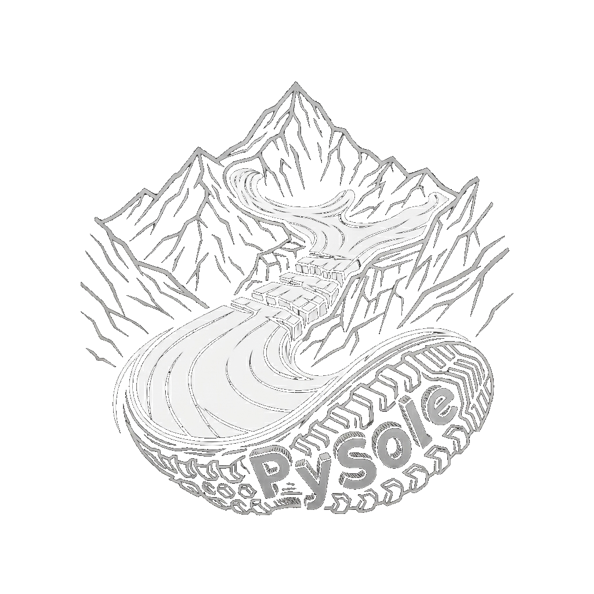

<p align="center">
  
</p>
<p style="text-align: center; font-size: 20px;"><strong>Physically-Informed Bedrock Interpolation & 3D Migration for Sparse Geophysical Datasets</strong></p>

`PySole` is designed to reconstruct the thickness distribution and basal topography (sole) of glaciers, landslides, and other gravity-driven, viscous flow phenomena. It adapts the **Shallow Ice Approximation** to estimate the thickness distribution based on the fundamental inverse relation between depth of the creeping body and its surface slope, where greater depths correspond to gentler surface slopes and vice versa. It is specifically engineered for sparse geophysical datasets where 3D wavefield migration to image the bedrock is impossible due to insufficient spatial sampling. `PySole` transforms limited survey points into robust, physically-constrained 3D bedrock models.

---

## Table of Contents

[Key Features](#key-features)<br><br>
[Baseline Workflow & Methodology](#workflow-and-methodology)<br><br>
[Installation](#installation)<br><br>
[JSON Configuration File](#json-configuration)<br><br>
[JSON Configuration Parameter Reference](#json-configuration-parameter-reference)<br><br>
[Technical & Methodological Notes](#technical-and-methodological-notes)<br>
&nbsp;&nbsp;&nbsp;&nbsp;[1. Supported DEM Formats](#supported-dem-formats)<br>
&nbsp;&nbsp;&nbsp;&nbsp;[2. Parsing of Rock Outcrop Input Files](#parsing-rock-outcrops)<br>
&nbsp;&nbsp;&nbsp;&nbsp;[3. Wavenumbers and Wavelengths](#wavenumber-to-wavelength-conversion)<br>
&nbsp;&nbsp;&nbsp;&nbsp;[4. Variogram Binning with Minimum Pair Threshold](#variogram-binning)<br>
&nbsp;&nbsp;&nbsp;&nbsp;[5. High-Performance Dual Kriging Vector Engine](#dual-kriging-vector-engine)<br>
&nbsp;&nbsp;&nbsp;&nbsp;[6. Robust Baseline Interpolation Strategies](#interpolation-strategies)<br>
&nbsp;&nbsp;&nbsp;&nbsp;[7. Universal Kriging Drift Models](#universal-kriging-drift-models)<br>
&nbsp;&nbsp;&nbsp;&nbsp;[8. Depth Uncertainty Derivation](#depth-uncertainty-derivation)<br>
&nbsp;&nbsp;&nbsp;&nbsp;[9. Spatial Smoothing of the Calculated DEMs](#dem-spatial-smoothing)<br><br>
[Package Architecture](#package-architecture)<br><br>
[Command-Line Interface (CLI) Execution](#cli-execution)<br><br>
[Python API & Quick Start](#python-api-and-quick-start)<br><br>
[Real-World Example: Wurtenkees Glacier](#real-world-example-wurtenkees-glacier)<br><br>
[Citation & References](#citation-and-references)

---

<a id="key-features"></a>
## Key Features

* **JSON Configuration & Terminal CLI Driven:** All processing workflow options can be defined in a `pysole.json` file and executed via Python API or directly from the terminal using the `pysole` command line tool.
* **Multi-Core Parallel Acceleration:** `PySole` supports multi-core CPU parallelization across computationally intensive processing steps.
* **Automated High-Resolution Diagnostic Plots:** Automatically generates and exports diagnostic figures for each key processing milestone.
* **5 Supported Digital Elevation Model (DEM) Input and Output Formats:** Seamless loading and exporting of GeoTIFFs (`.tif`), ESRI ASCII Grids (`.asc`, `.txt`), 3-column-CSV matrices (`.csv`, [X, Y, Z]), 2D-CSV matrices (`.csv`, [Z<sub>nx</sub> × Z<sub>ny</sub>]), NumPy binary arrays (`.npy`), and in-memory NumPy 2D arrays (`np.ndarray`).
* **Strict Coordinate Reference System & Spatial Alignment Verification:** Performs strict verification across all input layers (DEM, boundary outline, survey points). If any layer uses a different Coordinate Reference System (CRS) or falls outside the DEM spatial extent, processing halts with an explicit error.
* **Flexible Survey Data Types:** `PySole` accepts one- or two-way signal traveltimes as well as direct thickness/depth measurements as survey data type. In case of direct thickness/depth data the 3D migration is automatically skipped.
* 💡**DEM Surface Slope Smoothing💡:** The degree of DEM surface slope smoothing is crucial when estimating ice thickness with the <i>Shallow Ice Approximation</i> (SIA), which assumes a constant basal shear stress. By relaxing this rigid baseline constraint, Binder et al. (2009) derived an objective optimization criterion for the surface slope smoothing process, which is implemented in `PySole`. The optimal degree of surface slope smoothing is derived by enforcing minimum spatial variance in basal shear stress as the optimization criterion:
  <p align="center">
  $$\min_{k_{\text{c}}} \text{Var}_{xy}(\tau_{\text{b}})$$
  </p>

  In shallow ice dynamics, basal shear stress is given by:

  <p align="center">
  $$\tau_{\text{b}} = \rho_{\text{ice}} \, g \, D \sin(\alpha)$$
  </p>

  where ice density, <i>ρ</i><sub>ice</sub>, and gravitational acceleration, <i>g</i>, are assumed to be constant. Thus, just the product of the two variables ice depth and surface slope, <i>P</i> = <i>D</i> sin(<i>α</i>), is evaluated during the optimization process. The surface DEM is smoothed by low-pass filtering in the frequency domain from which the surface slope field is then derived. The <i>Fast Fourier Transform</i> (FFT) Gaussian low-pass filter is defined by the spatial cutoff wavenumber <i>k</i><sub>c</sub>, or optionally, by the cutoff wavelength $\lambda_c$. The spatial variance of <i>τ</i><sub>b</sub> is then quantified via variogram analysis. An interactive mode allows users to test varying degrees of smoothing across wavenumber cutoffs and refine the variogram parameters. This surface slope optimization methodology is an integral component for interpolating both pre-migration wavefront traveltimes and post-migration depths, as well as for the 3D migration. To accelerate the optimization process, both the FFT low-pass filtering and the corresponding product variogram evaluations are executed via multi-threaded CPU parallelization.
* **3D Ray-Based Migration:** `PySole` features an optional 3D ray-based migration—introduced by Binder et al. (2009) and engineered specifically to process geophysical signal traveltimes with sparse spatial coverage. The optimally smoothed surface slope field is also applied during the 3D migration to ensure numerically stable ray displacement vectors.
* **Kriging Interpolation:** Provides a native, numerically optimized, and parallelized 2D Kriging algorithm supporting both Ordinary and Universal Kriging. Two interpolation strategies are recommended as a **robust starting baseline**: <i>Ordinary Kriging</i> is initially recommended for interpolating basal shear stress (BSS) derived products based on the assumption of a constant spatial mean (no external drift). <i>Universal Kriging</i> using the Shallow Ice Approximation (`"sia"`) physical drift model is intially recommended for direct interpolation of signal traveltimes or (migrated) depths. Corresponding Kriging estimation uncertainty fields are calculated alongside all predicted grids.
* **Boundary Conditions:** Perimeter and rock outcrop margin boundary conditions (zero traveltime <i>T</i> = 0 s and zero thickness <i>D</i> = 0 m) are enforced by default (and can optionally be toggled off). Interior rock outcrops, or vector polygon holes, are natively parsed.
* **Interactive Drift Analyzer:** A fully automated diagnostic engine to identify the optimal Universal Kriging drift model for each individual survey dataset. Evaluates and ranks the available `PySole` drift models by a suite of statistical metrics. For full details, see the [`documentation manual`](docs/drift_analyzer_&_survey_planner.md).
* **ML Hole Filling & Geomorphological Margin Blending:** Employs the parallelized [`scikit-learn`](https://scikit-learn.org) Random Forest regression to patch blank regions and ensure complete spatial coverage after Kriging interpolation (optional step). Furthermore, geomorphological margin blending can be applied to smoothly taper bedrock elevations into the surrounding surface DEM terrain.
* **Final DEMs Spatial Smoothing:** As a post-processing step, spatial smoothing options are available for the calculated DEMs.
* **Survey Planner:** While Kriging uncertainty fields clearly reveal target regions for additional surveys, the `Survey Planner` automatically designs an optimal survey layout for future campaigns on unprobed objects. Longitudinal flowline and transverse cross-profile survey tracks are computed based on a SIA thickness model. Exports tracks to field-ready GPX and GeoJSON vector formats along with the SIA modeled thickness map. For full details, see the [`documentation manual`](docs/drift_analyzer_&_survey_planner.md).

---

<a id="workflow-and-methodology"></a>
## Baseline Workflow & Methodology

<p align="center">
  <a href="images/pysole_processing_pipeline.png">
    
  </a>
  <br>
  <em>Figure 1:  End-to-end computational workflow of the PySole solver dual-path processing pipeline. Click diagram to view in high resolution.</em>
</p>

#### 1. DEM Loading & Metadata
Grid spacing (`dx`, `dy`) and spatial bounds are automatically extracted from GeoTIFF and ESRI ASCII DEM metadata headers (and autodetected for 3-column `.csv` tables). If target `dx` and `dy` pixel resolutions are specified, 2D bilinear grid resampling is performed automatically.

For headerless DEM formats (2D `.csv` matrices, `.npy`, or `np.ndarray`), spatial parameters (`origin`, `crs`, `dx`, `dy`) should be provided under `spatial_parameters` to build the spatial metadata object.

> [!CAUTION]
> All input datasets (DEM, survey picks, and outline geometries) **must share the same projected, metric coordinate reference system** ( `"crs"`, e.g. 'Universal Transverse Mercator' (UTM)). Geographic coordinates (latitude/longitude in degrees) will cause invalid distance, surface slope, and basal shear stress calculations.

#### 2. Pre-Migration Traveltime Interpolation
Across spatial wavenumber cutoffs <i>k</i><sub>c</sub>, the point products of traveltime observations and corresponding low-pass filtered surface slopes, <i>P</i><sub>T,i</sub> = <i>T</i><sub>i</sub> sin(<i>α</i><sub>smoothed,i</sub>), are evaluated. Once the optimization criterion is satisfied, the optimally smoothed surface slope field, sin(<i>α</i><sub>opt</sub>(<i>x</i>,<i>y</i>)), is deployed in the subsequent Kriging interpolation. The recommended baseline interpolation strategy to start with depends on `pre_migration.interpolation_target`:
- **BSS-derived Product `"P"` (Default)**: `PySole` interpolates <i>P</i><sub>T,i</sub> using <b>Ordinary Kriging</b> with optional zero-traveltime boundary conditions (<i>T</i> = 0 s) by default to produce the continuous product field <i>P</i><sub>T</sub>(<i>x</i>,<i>y</i>). The continuous signal traveltime field <i>T</i>(<i>x</i>,<i>y</i>) is then reconstructed by dividing <i>P</i><sub>T</sub>(<i>x</i>,<i>y</i>) by the optimally smoothed surface slope field sin(<i>α</i><sub>opt</sub>(<i>x</i>,<i>y</i>)):

  <p align="center">
  $$T(x,y) = \frac{P_{\text{T}}(x,y)}{\sin(\alpha_{\text{opt}}(x,y))}$$
  </p>

- **Direct `"T"`**: Directly interpolates signal traveltimes <i>T</i><sub>i</sub> using <b>Universal Kriging</b> with the <b>SIA physical drift model</b> by default.

- **Smoothed Surface Slope Safeguard**: `PySole` employs a user-defined minimum threshold of the smoothed surface slopes (`slope_floor_deg`) to prevent numerical division singularities in low-gradient regions (default is <i>5°</i>).

#### 3. 3D Ray-Based Migration
The migration algorithm solves the Eikonal equation to relocate subsurface reflection points, particularly improving the imaging of steep slopes and overdeepenings. An interactive mode allows users to test different signal propagation velocities and evaluate them through visualizations of migrated depths and the corresponding horizontal survey point displacements induced by the migration process.

#### 4. Post-Migration Surface Slope Optimization
Analogous to the pre-migration optimization pass, `PySole` applies the optimization criterion to determine the post-migration optimally smoothed surface slope, sin(<i>α</i><sub>opt</sub>(<i>x</i>,<i>y</i>)), across spatial wavenumber cutoffs <i>k</i><sub>c</sub>. The post-migration surface slope optimization evaluates, however, the products of migrated depths and corresponding smoothed surface slopes, <i>P</i><sub>D,i</sub> = <i>D</i><sub>i</sub> sin(<i>α</i><sub>smoothed,i</sub>).

#### 5. Final Depth Interpolation & Uncertainty Display
Reconstructs continuous thickness <i>D</i>(<i>x</i>,<i>y</i>) and bedrock elevation <i>Z</i><sub>bed</sub>(<i>x</i>,<i>y</i>) fields. The recommended baseline interpolation strategy to start with depends on `post_migration.interpolation_target`:
- **BSS-derived Product `"P"` (Default)**: Interpolates point products <i>P</i><sub>D,i</sub> = <i>D</i><sub>i</sub> sin(<i>α</i><sub>opt,i</sub>) using <b>Ordinary Kriging</b> with optional zero-thickness boundary conditions (<i>D</i> = 0 m) by default. The continuous product field, <i>P</i><sub>D</sub>(<i>x</i>,<i>y</i>), is divided by the optimally smoothed surface slope field, sin(<i>α</i><sub>opt</sub>(<i>x</i>,<i>y</i>)), to receive the final depth field <i>D</i>(<i>x</i>,<i>y</i>).
- **Direct `"D"`**: Directly interpolates (migrated) survey point depths <i>D</i><sub>i</sub> using <b>Universal Kriging</b> with the <b>SIA physical drift model</b> by default.

The Kriging standard error for the interpolated depths is converted to meters to quantify depth uncertainty.

---

<a id="installation"></a>
## Installation

### Standard Installation via PyPI <strong><i> -> !!! NOT AVAILABLE YET !!!</i></strong>

```bash
pip install pysole
```

### Local / Development Installation

To install `PySole` directly from source in editable mode:

```bash
git clone https://github.com/da0bi/pysole.git
cd pysole
pip install -e .
```

---

<a id="json-configuration"></a>
## JSON Configuration File

All execution options can be fully defined in a single JSON configuration file, which by default is named `pysole.json`:

```json
{
    "inputs": {
        "dem_path": null,
        "outline_path": null,
        "survey_data_path": null,
        "survey_data_type": "one_way_traveltime",
        "survey_profile_column": null,
        "ice_density": 900.0,
        "g": 9.81,
        "n_cores": -1,
        "log_level": "INFO",
        "show_progress": true
    },
    "spatial_parameters": {
        "dx": null,
        "dy": null,
        "bounds": null,
        "origin": null,
        "crs": null
    },
    "migration_parameters": {
        "perform_migration": true,
        "velocity": 0.16,
        "interactive_migration": false
    },
    "optimization_parameters": {
        "fft_filter_metric": "wavenumber",
        "kc_max": null,
        "kc_min": null,
        "lambda_min": null,
        "lambda_max": null,
        "n_steps": null,
        "nrbins": null,
        "slope_floor_deg": 5.0,
        "interactive_optimization": false
    },
    "kriging_parameters": {
        "engine": "native",
        "pre_migration": {
            "interpolation_target": "P",
            "method": "ordinary",
            "drift_analyzer": false,
            "drift_terms": [],
            "variogram_model": "spherical",
            "include_zero_boundary_condition": true
        },
        "post_migration": {
            "interpolation_target": "P",
            "method": "ordinary",
            "drift_analyzer": false,
            "drift_terms": [],
            "variogram_model": "spherical",
            "include_zero_boundary_condition": true
        }
    },
    "finalization_parameters": {
        "random_forest_gap_filling": false,
        "apply_margin_blend": false,
        "min_gap_dist": 50.0,
        "smooth_bedrock": false,
        "smoothing_method": "gaussian",
        "smoothing_sigma": 1.5,
        "smoothing_kernel_size": 3,
        "smoothing_kc_cutoff": null
    },
    "outputs": {
        "output_dir": null,
        "output_format": "tif",
        "output_prefix": "final",
        "plots_dir": "figures",
        "save_traveltime_grid": false,
        "save_migrated_points": false,
        "save_thickness_grid": false,
        "save_thickness_uncertainty": false,
        "save_basal_shear_stress": false,
        "save_basal_shear_stress_uncertainty": false
    }
}
```

---

<a id="json-configuration-parameter-reference"></a>
## JSON Configuration Parameter Reference

| Section | Parameter | Type | Default | Description |
| :--- | :--- | :--- | :--- | :--- |
| **`inputs`** | `dem_path` | `str` | `null` | **(Required)** File path to the surface Digital Elevation Model (`.asc`, `.tif`, `.csv`, `.npy`). |
| | `outline_path` | `str` | `null` | File path to creeping body / glacier boundary polygon (`.shp`, `.geojson`, `.gpkg`, `.csv`). If `null`, domain is derived from non-NaN DEM pixels. |
| | `survey_data_path` | `str` | `null` | File path to signal traveltime or thickness observations CSV `[(profile_id), X, Y, value]`. If `null`, `PySole` automatically starts the interactive `Survey Planner` and saves the results to the file paths defined in the `outputs` section. For full details, see the [`documentation manual`](docs/drift_analyzer_&_survey_planner.md). |
| | `survey_data_type` | `str` | `"one_way_traveltime"` | Observation data type: `"one_way_traveltime"`, `"two_way_traveltime"`, or `"depth"` (skips 3D migration). |
| | `survey_profile_column` | `str` | `null` | Optional CSV column name specifying survey line / profile IDs for the `Drift Analyzer'´s <i>Leave-One-Profile-Out</i> cross-validation. |
| | `ice_density` | `float` | `900.0` | Density of the creeping medium in kg/m³ (`900.0` kg/m³ for temperate glacier ice by default). Used to calculate basal shear stress $\tau_{\text{b}}$. |
| | `g` | `float` | `9.81` | Gravitational acceleration constant in m/s² (`9.81` m/s²). Used to calculate basal shear stress $\tau_{\text{b}}$. |
| | `n_cores` | `int` | `-1` | Number of CPU cores applied across all parallelized processes (`-1` for all available cores). |
| | `log_level` | `str` | `"INFO"` | Package logging level verbosity: `"INFO"` (default), `"DEBUG"`, `"WARNING"`, `"ERROR"`, or `"CRITICAL"`. Appends timestamped logs to `pysole.log`. |
| | `show_progress` | `bool` | `true` | If `true` (default), displays terminal progress bars during heavy processing steps. Set to `false` if running `PySole` in batch processing scripts. |
| **`spatial_parameters`** | `dx` | `float` | `null` | Target grid resolution along X in meters. If defined, automatically resamples the DEM grid. If `null`, native resolution is kept. |
| | `dy` | `float` | `null` | Target grid resolution along Y in meters. If defined, automatically resamples the DEM grid. If `null`, native resolution is kept. |
| | `bounds` | `list[float]` | `null` | Optional spatial bounding box `[minx, miny, maxx, maxy]`. Leave `null` by default. Use only to manually override invalid or missing spatial bounds in DEM raster headers (`.asc`, `.tif`). `bounds` are automatically calculated from `origin`, `dx`, `dy`, and grid dimensions for headerless DEMs (`.csv`, `.npy`). |
| | `origin` | `list[float]` | `null` | Lower-left coordinate origin `[xll, yll]` in projected metric units for headerless DEM formats (`.csv`, `.npy`, `np.ndarray`). If `null`, defaults to `(0.0, 0.0)`. |
| | `crs` | `str` / `int` | `null` | Coordinate Reference System (optional, e.g. `"EPSG:32633"`, `32633`, or PROJ string). When provided, validates metric projection, checks spatial alignment with vector outlines, and embeds EPSG metadata into output GeoTIFFs. |
| **`migration_parameters`** | `perform_migration` | `bool` | `true` | If `true`, performs 3D ray-based migration on signal traveltimes. If `false`, migration is skipped. |
| | `velocity` | `float` | `0.16` | Signal propagation velocity (default value of `0.16` m/ns is characteristic for radar wave propagation in temperate ice). |
| | `interactive_migration` | `bool` | `false` | If `true`, enables interactive velocity testing with visual migrated depths and horizontal displacement vector plots. |
| **`optimization_parameters`** | `fft_filter_metric` | `str` | `"wavenumber"` | Frequency spectrum filter metric: `"wavenumber"` [rad/m] or `"wavelength"` [m]. |
| | `kc_max` | `float` | `null` | Maximum corner frequency cutoff $k_{\text{c,max}}$ in [rad/m]. If `null`, defaults to grid Nyquist wavenumber $k_{\text{Nyquist}}$. For full details, see section [Wavenumbers and Wavelengths](#wavenumber-to-wavelength-conversion). |
| | `kc_min` | `float` | `null` | Minimum corner frequency cutoff $k_{\text{c,min}}$ in [rad/m]. If `null`, defaults to half of the DEM extent. For full details, see section [Wavenumbers and Wavelengths](#wavenumber-to-wavelength-conversion).|
| | `lambda_min` | `float` | `null` | Minimum spatial cutoff wavelength $\lambda_{\text{min}}$ in [m]. If `null`, falls back directly to `kc_max`. For full details, see section [Wavenumbers and Wavelengths](#wavenumber-to-wavelength-conversion). |
| | `lambda_max` | `float` | `null` | Maximum spatial cutoff wavelength $\lambda_{\text{max}}$ in [m]. If `null`, falls back directly to `kc_min`. For full details, see section [Wavenumbers and Wavelengths](#wavenumber-to-wavelength-conversion). |
| | `n_steps` | `int` | `null` | Number of $k_{\text{c}}$ steps, defining regular $\delta k = \frac{(k_{\text{c,max}}-k_{\text{c,min}})}{n_steps}$ . If `null`, dynamically calculated from DEM grid and constrained by $[10, 50]$. For full details, see section [Wavenumbers and Wavelengths](#wavenumber-to-wavelength-conversion). |
| | `nrbins` | `int` | `null` | Number of variogram lag distance bins. If `null` (default), dynamically calculated to receive ~30 point pairs per bin, and an absolute minimum floor of 3 bins. For full details, see section [Variogram Binning with Minimum Pair Threshold](#variogram-binning). |
| | `slope_floor_deg` | `float` | `5.0` | Minimum surface slope angle threshold in degrees [°] enforced during surface slope optimization to prevent numerical division singularities. |
| | `interactive_optimization` | `bool` | `false` | If `true`, enables interactive CLI prompt to inspect BSS variance curve and adjust corner frequency spectrum parameters (`kc_min`, `kc_max`, `lambda_min`, `lambda_max`, `n_steps`), lag distance bin count (`nrbins`), and correlation range (`a_range`). |
| **`kriging_parameters`** | `engine` | `str` | `"native"` | Kriging calculation engine: `"native"` (default, high-performance Dual Kriging solver) or `"pykrige"` (uses external [`PyKrige`](https://geostat-framework.readthedocs.io/projects/pykrige) package - optional dependency in `pyproject.toml`). |
| | `pre_migration` | `dict` | *Sub-section* | Configuration for pre-migration traveltime field, <i>T</i>(<i>x</i>,<i>y</i>), interpolation. |
| | `pre_migration.interpolation_target` | `str` | `"P"` | Pre-migration interpolation targets: `"P"` for BSS-derived products (<i>P</i> = <i>T</i><sub>i</sub> · sin <i>α</i><sub>opt, i</sub>, default) or `"T"` for direct signal traveltimes (<i>T</i><sub>i</sub>). |
| | `pre_migration.method` | `str` | `"ordinary"` | Kriging approach: `"ordinary"` (the default for `pre_migration.interpolation_target`: `"P"`), `"universal"` (the default for `pre_migration.interpolation_target`: `"T"`), or `"regression"` (only available for `engine`: `"pykrige"`). |
| | `pre_migration.drift_analyzer` | `bool` | `false` | If `true`, runs the interactive Universal Kriging `Drift Analyzer` tool. For full details, see the [`documentation manual`](docs/drift_analyzer_&_survey_planner.md). |
| | `pre_migration.drift_terms` | `list[str]` | `[]` | `["sia"]` (SIA physical drift model - the default for `pre_migration.interpolation_target`: `"T"`). If left empty `[]` (the default for `pre_migration.interpolation_target`: `"P"`) applies a constant mean, resulting in Ordinary Kriging. All available single and multi drift models are described in the subsection "7. Universal Kriging Drift Models" in the "Technical & Methodological Notes". |
| | `pre_migration.variogram_model` | `str` | `"spherical"` | Theoretical variogram model (`"spherical"`, `"exponential"`, `"gaussian"`, `"linear"`). |
| | `pre_migration.include_zero_boundary_condition` | `bool` | `true` | If `true` (default), includes zero traveltime boundary points (<i>T</i> = 0 s) along the perimeter and rock outcrop margin outline(s). |
| | `post_migration` | `dict` | *Sub-section* | Configuration for final bedrock depth, <i>D</i>(<i>x</i>,<i>y</i>), interpolation. |
| | `post_migration.interpolation_target` | `str` | `"P"` | Post-migration interpolation targets: `"P"` for BSS-derived products (<i>P</i> = <i>D</i><sub>i</sub> · sin <i>α</i><sub>opt, i</sub>, default) or `"T"` for direct (migrated) depths (<i>D</i><sub>i</sub>). |
| | `post_migration.method` | `str` | `"ordinary"` | Kriging approach: `"ordinary"` (the default for `post_migration.interpolation_target`: `"P"`), `"universal"` (the default for `post_migration.interpolation_target`: `"T"`), or `"regression"` (only available for `engine`: `"pykrige"`). |
| | `post_migration.drift_analyzer` | `bool` | `false` | If `true`, runs the interactive Universal Kriging `Drift Analyzer` tool. For full details, see the [`documentation manual`](docs/drift_analyzer_&_survey_planner.md). |
| | `post_migration.drift_terms` | `list[str]` | `[]` |  `["sia"]` (SIA physical drift model - the default for `pre_migration.interpolation_target`: `"T"`). If left empty `[]` (the default for `pre_migration.interpolation_target`: `"P"`) applies a constant mean, resulting in Ordinary Kriging. All available single and multi drift models are described in the subsection "7. Universal Kriging Drift Models" in the "Technical & Methodological Notes". |
| | `post_migration.variogram_model` | `str` | `"spherical"` | Theoretical variogram model (`"spherical"`, `"exponential"`, `"gaussian"`, `"linear"`). |
| | `post_migration.include_zero_boundary_condition` | `bool` | `true` | If `true` (default), includes zero thickness boundary points (<i>D</i> = 0 m) along the perimeter and rock outcrop margin outline(s). |
| **`finalization_parameters`** | `random_forest_gap_filling` | `bool` | `false` | If `true`, applies Random Forest machine learning gap filling across unmeasured interior regions. |
| | `apply_margin_blend` | `bool` | `false` | If `true`, applies geomorphological margin blending to seamlessly transition calculated bedrock elevation to surrounding surface DEM terrain. |
| | `min_gap_dist` | `float` | `50.0` | Minimum gap distance in meters inside which bedrock is smoothly tapered and blended into surface DEM terrain. |
| | `smooth_bedrock` | `bool` | `false` | If `true`, applies spatial DEM post-processing smoothing directly to the depth field <i>D</i>(<i>x</i>,<i>y</i>) to eliminate high-frequency slope-division noise. |
| | `smoothing_method` | `str` | `"gaussian"` | Final bedrock DEM smoothing algorithm choice: `"gaussian"` (default), `"median"`, or `"fft_lowpass"`. |
| | `smoothing_sigma` | `float` | `1.5` | Smoothing strength (radius in pixels) for `"gaussian"` filtering. Higher values produce smoother bedrock terrain. |
| | `smoothing_kernel_size` | `int` | `3` | Window kernel size (<i>k</i> × <i>k</i>) for `"median"` filtering (must be an odd integer). Higher values produce smoother bedrock terrain. |
| | `smoothing_kc_cutoff` | `float` | `null` | Corner frequency cutoff wavenumber (<i>k</i><sub>c,smooth</sub>) for `"fft_lowpass"`. If `null`, defaults to <i>k</i><sub>c,opt</sub> from the surface slope smoothing optimization. <i>Lower</i> values produce smoother bedrock terrain. |
| **`outputs`** | `output_dir` | `str` | `null` | General workspace directory for all output files. `"."` defines `output_dir` as the parent directory of the `pysole.json` configuration file. If `null` (default), automatically creates a `pysole` folder inside the parent directory of `survey_data_path`. All relative output paths are resolved relative to `output_dir`. Absolute output paths override `output_dir`. |
| | `output_format` | `str` / `list[str]` | `"tif"` | Desired export format(s): `"tif"`, `"asc"`, `"csv"`, `"npy"`, a list of formats (e.g. `["tif", "asc", "csv"]`), or `"all"` to export all four formats. |
| | `output_prefix` | `str` | `"final"` | Filename prefix or absolute filepath prefix used to construct export filenames. Do not include file extensions—format extension(s) are determined by `output_format`. Relative prefix names resolve inside `output_dir`; absolute filepaths override `output_dir`. 🚨 The final bedrock grid `<output_prefix>_bedrock.<ext>` is exported by default. 🚨 |
| | `plots_dir` | `str` | `"figures"` | Output directory for saving diagnostic figures. All generated figures are saved automatically. If `null`, figures are saved into a `"figures"` folder inside `output_dir`. An absolute path overrides `output_dir/figures`. |
| | `save_traveltime_grid` | `bool` | `false` | If `true`, exports the pre-migration interpolated traveltime raster grid, <i>T</i>(<i>x</i>,<i>y</i>), masked by the creeping body outline to `<output_prefix>_traveltime.<ext>`. |
| | `save_migrated_points` | `bool` | `false` | If `true`, exports the 3D ray-migrated survey points to `<output_prefix>_migrated_points.csv` (`x, y, z_surface, depth_migrated`). If migration is skipped, it is automatically set to `false` and a log message is printed. |
| | `save_thickness_grid` | `bool` | `false` | If `true`, exports the final thickness raster grid, <i>D</i>(<i>x</i>,<i>y</i>), masked by the creeping body outline to `<output_prefix>_thickness.<ext>`. |
| | `save_thickness_uncertainty` | `bool` | `false` | If `true`, exports the Kriging thickness uncertainty raster grid, <i>σ<sub>D</sub></i>(<i>x</i>,<i>y</i>), masked by the creeping body outline to `<output_prefix>_thickness_uncertainty.<ext>`. |
| | `save_basal_shear_stress` | `bool` | `false` | If `true`, exports the final basal shear stress raster grid, <i>τ</i><sub>b</sub>(<i>x</i>,<i>y</i>), masked by the creeping body outline to `<output_prefix>_basal_shear_stress.<ext>`. |
| | `save_basal_shear_stress_uncertainty` | `bool` | `false` | If `true`, exports the basal shear stress Kriging uncertainty raster grid, <i>σ</i><sub><i>τ</i><sub>b</sub></sub>(<i>x</i>,<i>y</i>), masked by the creeping body outline to `<output_prefix>_basal_shear_stress_uncertainty.<ext>`. |

---

<a id="technical-and-methodological-notes"></a>
## Technical & Methodological Notes

<a id="supported-dem-formats"></a>
#### 1. Supported DEM Formats
`PySole` supports 5 distinct DEM formats:

- **GeoTIFF (`.tif`, `.tiff`, `.geotiff`)**: *Recommended*. Automatically extracts spatial bounds, CRS, pixel resolution, and `nodata` values using [`rasterio`](https://rasterio.readthedocs.io).
- **ESRI ASCII Grid (`.asc`, `.txt`)**: Standard 6-line header GIS raster format. Automatically extracts `ncols`, `nrows`, `xllcorner`, `yllcorner`, `cellsize`, and `nodata_value`. It is recommended to explicitly define the coordinate reference system using the `crs` parameter inside `spatial_parameters`.
- **CSV Grid (`.csv`)**: Supports both **2D elevation matrices** ([Z<sub>nx</sub> × Z<sub>ny</sub>]) and **3-column XYZ grid tables** ([X, Y, Z]). For 3-column tables, cell spacing (`dx`, `dy`) and bounds are automatically inferred. However, it is recommended to explicitly define the coordinate reference system using the `crs` parameter. For 2D matrices, metadata is built from `spatial_parameters`.
- **NumPy Binary Array (`.npy`)**: Fast 2D binary array format. Spatial metadata (`origin`, `crs`, `dx`, `dy`) is defined via `spatial_parameters`.
- **NumPy 2D Array (`np.ndarray`)**: In-memory array passed directly into the `Solver` constructor (`dem=dem_grid`). Spatial metadata is defined via `spatial_parameters`.

<a id="parsing-rock-outcrops"></a>
#### 2. Parsing of Rock Outcrop Input Files
Vector polygon files (`.shp`, `.geojson`, `.gpkg`) or CSV outline files containing interior rings (separated by `NaN` rows) are automatically parsed as polygon holes. `PySole` treats pixels inside rock outcrop holes as exposed bedrock (<i>Z</i> = <i>Z</i><sub>Surface</sub>). When boundary conditions are enabled, the perimeters of interior rings are included, applying <i>T</i> = 0 s or <i>D</i> = 0 m.

For rock outcrop holes to be detected correctly from a Shapefile (`.shp`):

- **Topology**: The outcrop must be stored as an interior ring (`polygon.interiors`) within a single `Polygon` / `MultiPolygon` feature (e.g. created using QGIS "Add Ring" or ArcGIS "Construct Hole").
- **Winding Order**: Standard OGC orientation (Clockwise exterior boundary, Counter-Clockwise interior hole rings).
- **CRS Alignment**: The shapefile's Coordinate Reference System must match the DEM raster projection.
- **Valid Geometries**: Rings must not intersect themselves (`PySole` automatically executes `validate_and_extract_polygons()` on load to auto-repair geometries or fall back to the outer boundary shell if holes fail criteria).

<a id="wavenumber-to-wavelength-conversion"></a>
#### 3. Wavenumbers and Wavelengths
In `PySole`, 2D spatial Gaussian low-pass smoothing operates in the physical 2D spatial frequency domain. Spatial wavenumber components along orthogonal grid axes $X$ and $Y$ are constructed in physical units of **[radians per meter]** as:

<p align="center">
$$\begin{aligned}
k_x &= 2\pi \cdot f_{x,\text{phys}} = \frac{2\pi \cdot \text{fftfreq}(N_x)}{dx} \quad [\text{rad/m}] \\
k_y &= 2\pi \cdot f_{y,\text{phys}} = \frac{2\pi \cdot \text{fftfreq}(M_y)}{dy} \quad [\text{rad/m}]
\end{aligned}$$
</p>

where $dx, dy$ are spatial grid cell resolutions in **[meters]**, and $N_x, M_y$ are grid dimensions. The 2D spatial wavenumber magnitude is $k = \sqrt{k_x^2 + k_y^2}$ [rad/m].

Physical angular wavenumber $k_c$ [rad/m] relates directly to physical spatial wavelength $\lambda_c$ [meters] via the fundamental physical relationship:

<p align="center">
$$k_c = \frac{2\pi}{\lambda_c} \quad \Longleftrightarrow \quad \lambda_c = \frac{2\pi}{k_c}$$
</p>

##### Concrete Calculation Example ($dx = 5.0\text{ m}, dy = 5.0\text{ m}$)
For a DEM with spatial resolution $dx = 5.0\text{ m}, dy = 5.0\text{ m}$:
1. **Minimum Physical Nyquist Wavelength**: $\lambda_{\text{Nyquist}} = 2 \cdot \min(dx, dy) = 2 \cdot 5.0\text{ m} = \mathbf{10.0\text{ m}}$ (the shortest feature resolvable on a 5m grid).
2. **Maximum Physical Nyquist Wavenumber**: $k_{\text{Nyquist}} = \frac{2\pi}{\lambda_{\text{Nyquist}}} = \frac{\pi}{5.0} \approx \mathbf{0.6283\text{ rad/m}}$.

##### Physical Reference Conversion Table ($5\text{ m} \times 5\text{ m}$ DEM)

| Cutoff Wavenumber $k_c$ [rad/m] | Spatial Wavelength $\lambda_c$ [m] | Glaciological Feature Scale |
| :--- | :--- | :--- |
| **$k_{\text{Nyquist}} \approx 0.6283\text{ rad/m}$** | $\mathbf{10.0\text{ m}}$ | Nyquist limit ($2 \cdot \min(dx, dy)$, finest resolvable feature) |
| **$0.3142\text{ rad/m}$** | $\mathbf{20.0\text{ m}}$ | Fine spatial smoothing (filters features $< 20\text{ m}$) |
| **$0.1257\text{ rad/m}$** | $\mathbf{50.0\text{ m}}$ | Medium-fine spatial smoothing |
| **$0.0628\text{ rad/m}$** | $\mathbf{100.0\text{ m}}$ | Medium spatial smoothing |
| **$0.0314\text{ rad/m}$** | $\mathbf{200.0\text{ m}}$ | Broad spatial smoothing |
| **$0.0100\text{ rad/m}$** | $\mathbf{628.3\text{ m}}$ | Very broad regional smoothing |

Both $k_c$ [rad/m] and $\lambda_c$ [m] are reported in `PySole` log output and can be selected via the `"fft_filter_metric"` setting (`"wavenumber"` or `"wavelength"`).

##### Derivation of FFT Filter Parameter Defaults (`kc_max`, `kc_min`, `lambda_min`, `lambda_max`, `n_steps`)

When `kc_max`, `kc_min`, `lambda_min`, `lambda_max`, or `n_steps` are left as `null` in `pysole.json`, `PySole` dynamically derives physically sound parameter defaults based on the DEM spatial resolution ($\Delta x, \Delta y$) and total domain extent ($L_{\text{max}} = \max(N_x \cdot |dx|, M_y \cdot |dy|)$):

1. **Maximum Frequency Cutoff $k_{\text{c,max}}$ and Minimum Wavelength $\lambda_{\text{min}}$**:
   - **`kc_max` Default**: Defaults to the spatial Nyquist wavenumber limit of the DEM grid:
     <p align="center">
     $$k_{\text{c,max}} = k_{\text{Nyquist}} = \frac{\pi}{\min(|dx|, |dy|)} \quad [\text{rad/m}]$$
     </p>
   - **`lambda_min` Wavelength Metric & Fallback**: If the user provides a custom $\lambda_{\text{min}}$ [m], it converts directly to wavenumber as $k_{\text{c,max}} = 2\pi / \lambda_{\text{min}}$ for the FFT filtering. When `lambda_min` is `null` (or when `fft_filter_metric = "wavelength"` with `null` `lambda_min`), `PySole` falls back directly to `kc_max` ($k_{\text{Nyquist}}$).

2. **Minimum Frequency Cutoff $k_{\text{c,min}}$ and Maximum Wavelength $\lambda_{\text{max}}$**:
   - **`kc_min` Default (Half-Domain Limit)**: Defaults to the Half-Domain scaling limit:
     <p align="center">
     $$k_{\text{c,min}} = \frac{4\pi}{L_{\text{DEM,max}}} \quad [\text{rad/m}]$$
     </p>
     This constrains the maximum filter wavelength to half the physical DEM extent ($\lambda_{\text{max}} = L_{\text{DEM,max}} / 2$).
   - **`lambda_max` Wavelength Metric & Fallback**: If the user provides a custom $\lambda_{\text{max}}$ [m], it converts directly to wavenumber as $k_{\text{c,min}} = 2\pi / \lambda_{\text{max}}$ for the FFT filtering. When `lambda_max` is `null`, `PySole` falls back directly to `kc_min` ($4\pi / L_{\text{max}}$).

3. **Evaluation Step Count `n_steps` (Discrete Fourier Mode Counting)**:
   - When `n_steps` is `null`, `PySole` dynamically calculates the number of integer Fourier modes spanning the frequency search range $[k_{\text{c,min}}, k_{\text{c,max}}]$ over the maximum domain length $L_{\text{DEM,max}}$:
     <p align="center">
     $$n_{\text{modes}} = \left\lfloor \frac{(k_{\text{c,max}} - k_{\text{c,min}}) \cdot L_{\text{max}}}{2\pi} \right\rfloor$$
     </p>
   - The evaluation step count is then dynamically clamped between a minimum floor of 10 steps and a maximum ceiling of 50 steps:
     <p align="center">
     $$n_{\text{steps}} = \text{clip}(n_{\text{modes}}, 10, 50)$$
     </p>
   - The candidate corner frequency vector $\mathbf{k}_c$ is generated as a linearly spaced array from $k_{\text{c,max}}$ down to $k_{\text{c,min}}$ with $n_{\text{steps}}$ evaluation passes.

<a id="variogram-binning"></a>
#### 4. Variogram Binning with Minimum Pair Threshold
Experimental variogram lag distance bins are calculated from the pairwise Euclidean distances across a total of $N$ survey points. Users can specify a fixed number of lag bins via `nrbins` under `optimization_parameters` in `pysole.json`, or during the `interactive_optimization` procedure. When `nrbins` is set to `null` (default), PySole initially determines a minimum distance bin count based on the total number of survey point pairs ($N_{\text{pairs}} = \frac{N(N-1)}{2}$):

$$
\text{nrbins} = \max\left(3, \frac{N_{\text{pairs}}}{30}\right)
$$

Enforcing a minimum threshold of at least **30 point pairs per lag bin** aligns with established geostatistical literature (e.g. Webster and Oliver, 2007), ensuring robust experimental variogram estimation and stable theoretical model curve fitting. If a user-specified `nrbins` yields, however, fewer than 30 average point pairs per bin, a diagnostic warning is emitted while honoring the user's explicit bin choice. An absolute lower floor of 3 lag distance bins is enforced across all calculations.

<a id="dual-kriging-vector-engine"></a>
#### 5. High-Performance Dual Kriging Vector Engine
`PySole` features a native, numerically optimized geostatistical engine based on **Dual Kriging** (Matheron, 1981). Unlike standard Kriging implementations (Primal Kriging) that solve node-specific linear systems point-by-point for every target grid node (requiring millions of repetitive matrix inversions across a high-resolution DEM), Dual Kriging solves the global linear system only once for the entire sample observation set:

<p align="center">
$$\mathbf{K} \mathbf{w}_{\text{z}} = \mathbf{z}_{\text{aug}}$$
</p>

where <i>K</i> is the augmented sample-to-sample covariance/variogram matrix, <i>z</i><sub>aug</sub> = [<i>z</i><sub>1</sub>, ..., <i>z</i><sub><i>N</i></sub>, 0, ..., 0]<sup>T</sup> contains the known data points augmented with zero drift constraints, and <i>w</i><sub>z</sub> = [<i>w</i><sub>sample</sub><sup>T</sup>, <i>w</i><sub>drift</sub><sup>T</sup>]<sup>T</sup> = [<i>b</i><sub>1</sub>, ..., <i>b</i><sub><i>N</i></sub>, <i>a</i><sub>1</sub>, ..., <i>a</i><sub><i>L</i></sub>]<sup>T</sup> is the single global dual weight vector solved via <i>Lower-Upper</i> (LU) matrix decomposition. Once <i>w</i><sub>z</sub> is computed, spatial interpolation across all target grid nodes simplifies to a single <i>Basic Linear Algebra Subprograms</i> (BLAS)-accelerated 1D vector dot product:

<p align="center">
$$Z_{\text{grid}} = \mathbf{w}_{\text{sample}} \cdot \boldsymbol{\Gamma}_{\text{grid}} + \mathbf{w}_{\text{drift}} \cdot \mathbf{F}_{\text{grid}}$$
</p>

where:
- <i>Z</i><sub>grid</sub> is the predicted output value (e.g., bedrock elevation or depth) at target grid node (<i>x</i>, <i>y</i>).
- <i>w</i><sub>sample</sub> = [<i>b</i><sub>1</sub>, ..., <i>b</i><sub><i>N</i></sub>] are the solved dual spatial weights for each of the <i>N</i> data points.
- <i>Γ</i><sub>grid</sub> = [&gamma;(<i>x</i><sub>1</sub>, <i>x</i><sub>grid</sub>), ..., &gamma;(<i>x</i><sub><i>N</i></sub>, <i>x</i><sub>grid</sub>)]<sup>T</sup> is the 1D sample-to-grid cross-variogram vector measuring spatial correlation between each data point and target node (<i>x</i>, <i>y</i>).
- <i>w</i><sub>drift</sub> = [<i>a</i><sub>1</sub>, ..., <i>a</i><sub><i>L</i></sub>] are the solved dual drift model coefficients.
- <i>F</i><sub>grid</sub> is the drift function vector evaluated at target node (<i>x</i>, <i>y</i>) (e.g. constant mean, coordinate trends, or SIA physical ice thickness drift).

To guarantee numerical stability during matrix decomposition, diagonal Tikhonov regularization adds a small offset (10<sup>−6</sup>) to the main diagonal of <i>K</i>, ensuring positive-definiteness and preventing matrix singularities. Combined with zero-centered spatial coordinate normalization and multi-threaded CPU chunk parallelization (`ThreadPoolExecutor`), PySole's Dual Kriging Vector Engine achieves a **~180x speedup** over loop-based solvers (interpolating 300,000+ DEM grid points in under 50 milliseconds) while maintaining complete mathematical parity with standard Universal Kriging.

<a id="interpolation-strategies"></a>
#### 6. Robust Baseline Interpolation Strategies
While users can combine any available interpolation options and deploy the `Drift Analyzer` to find the optimum Universal Kriging drift model, the following two interpolation strategies are recommended as a robust starting baseline. These are implemented in `PySole` as the default approaches based on the selected target variable (`interpolation_target`: `"P"`, `"T"`, or `"D"`):

- **BSS-derived Product `"P"` Strategy**: Interpolates the BSS-derived product field $P = T \sin \alpha_{\text{opt}}$ (pre-migration) or $P = D \sin \alpha_{\text{opt}}$ (post-migration). **Ordinary Kriging** is initially recommended for BSS-derived product targets.

> [!CAUTION]
> Avoid interpolating a BSS-derived product `"P"` with Universal Kriging applying the `"sia"` drift model! This creates a $1/\sin^2(\alpha)$ double-scaling artifact which leads to implausibly large depths at low slopes and is therefore strongly discouraged.

- **Direct `"T"` or `"D"` Strategy**: Directly interpolates signal traveltimes $T_i$ (pre-migration) or (migrated) depths $D_i$. **Universal Kriging** with the `"sia"` physical drift model is initially recommended.

<a id="universal-kriging-drift-models"></a>
#### 7. Universal Kriging Drift Models
`PySole` provides the following **Single Drift Models**:

- **Shallow Ice Approximation Physical Drift Model (`["sia"]`)**:
   `PySole` offers the physically-informed custom `"sia"` drift model. Re-arranging the basal shear stress $\tau_{\text{b}}$ for ice depth $D$ yields the inverse relationship between $D(x,y)$ and $\sin(\alpha_{\text{opt}}(x,y))$. Setting the drift term parameter to `["sia"]` informs Universal Kriging of the relative thickness distribution pattern driven directly by the optimized DEM surface slope:

   <p align="center">
   $$U(x,y) = \sin(\alpha_{\text{opt}}(x,y))^{-1}$$
   </p>

   Thus, producing a terrain-conforming, physically realistic background trend across unmeasured gap regions without requiring assumptions about absolute $\tau_{\text{b}}$ values. The custom physical SIA drift model is available for both pre- and post-migration Universal Kriging interpolations, and is the default for `interpolation_target`: `"T"` or `"D"`. A surface slope floor safeguard (`slope_floor_deg`, default 5.0°) clamps ultra-low slope angles prior to computing the inverse-sine drift, preventing matrix singularities. Just use it with `interpolation_target`: `"T"`, or `"D"` to avoid double-scaling artifacts .

- **Surface Elevation Drift Model (`["z_dem"]`)**:
   Uses the DEM surface elevation $Z_{\text{dem}}(x,y)$ as a spatial drift variable:

   <p align="center">
   $$U(x,y) = Z_{\text{dem}}(x,y)$$
   </p>

   <i>This models elevation-dependent thickness pattern—larger depths in lower valley basins/confluence zones, and smaller depths on high-altitude ridges and summits.</i>

- **Surface Curvature Drift Model (`["curvature_dem"]`)**:
   Uses the 2D Laplacian surface curvature $C_{k_c}(x,y)$ derived from the optimal smoothed DEM surface:

   <p align="center">
   $$C_{k_c}(x,y) = \nabla^2 Z_{\text{smooth, } k_c}(x,y) = \frac{\partial^2 Z}{\partial x^2} + \frac{\partial^2 Z}{\partial y^2}$$
   </p>

   <i>This models morphometric terrain curvature—predicting smaller depths at convex peaks and ridges ($\nabla^2 Z < 0$), and larger depths at concave bowls and valleys ($\nabla^2 Z > 0$).</i>

- **Linear Surface Drift Model (`["linear_xy"]`)**:
   Fits a flat, tilted 2D plane across the $X$ and $Y$ grid axes whose contour lines are straight, parallel, and evenly spaced across map space:

   <p align="center">
   $$U(x,y) = a_1 X + a_2 Y$$
   </p>

   <i>This models a constant regional spatial gradient across the entire map space—ideal for flow features with a linear regional trend.</i>

- **Quadratic Surface Drift Model (`["quadratic_xy"]`)**:
   Fits a parabolic surface (3D paraboloid, bowl, dome, or saddle) across the $X$ and $Y$ grid axes with curved parabolas, ellipses, or hyperbolas as contour lines:

   <p align="center">
   $$U(x,y) = a_1 X + a_2 Y + a_3 X^2 + a_4 Y^2 + a_5 X Y$$
   </p>

   <i>This captures regional spatial bends, ice cap domes, or radial thickness distributions across the entire map space.</i>

- **Empty Drift Model (`[]`)**:
   An empty drift model parameter assumes a constant local spatial mean (no external drift), which mathematically equates to an Ordinary Kriging approach.

<br>`PySole` natively supports combining external raster drift models (`["z_dem"]`, `["curvature_dem"]`, or `["sia"]`) with polynomial spatial coordinate trends (`["quadratic_xy"]` or `["linear_xy"]`) into an augmented multi-drift Universal Kriging system.<br>
<br>`PySole` provides the following **Multi Drift Models**:

- **`["z_dem", "curvature_dem", "quadratic_xy"]` ($n_{\text{drift}} = 8$)**:
   Combines DEM elevation, surface curvature, and a 2nd-order spatial polynomial:

   <p align="center">
   $$U(x,y) = a_1 Z_{\text{dem}} + a_2 \nabla^2 Z_{\text{smooth}} + a_3 X + a_4 Y + a_5 X^2 + a_6 Y^2 + a_7 X Y$$
   </p>

   <i>Recommended for more complex viscous flow features where elevation guides regional thickness distribution, surface curvature captures local ridge or basin concavity, and 2D quadratic spatial coordinates capture large-scale regional trend curvature (e.g. the central dome of an ice cap). Can be safely combined with `interpolation_target`: `"P"`.</i>

- **`["curvature_dem", "quadratic_xy"]` ($n_{\text{drift}} = 7$)**:
   Combines surface curvature with a 2nd-order spatial polynomial:

   <p align="center">
   $$U(x,y) = a_1 \nabla^2 Z_{\text{smooth}}(x,y) + a_2 X + a_3 Y + a_4 X^2 + a_5 Y^2 + a_6 X Y$$
   </p>

   <i>Recommended for e.g. alpine-type valley glaciers and cirques where terrain concavity/convexity is the primary morphometric indicator of ice thickness. Can be safely combined with `interpolation_target`: `"P"`.</i>

- **`["z_dem", "quadratic_xy"]` ($n_{\text{drift}} = 7$)**:
   Combines DEM surface elevation with a 2nd-order spatial polynomial:

   <p align="center">
   $$U(x,y) = a_1 Z_{\text{dem}}(x,y) + a_2 X + a_3 Y + a_4 X^2 + a_5 Y^2 + a_6 X Y$$
   </p>

   <i>Recommended for radial complexes with outlet valleys, where elevation guides the macro-scale dome-to-outlet trend while quadratic space terms capture 2D radial planform geometry. Can be safely combined with `interpolation_target`: `"P"`.</i>

- **`["sia", "quadratic_xy"]` ($n_{\text{drift}} = 7$)**:
   Combines the SIA slope factor with a 2nd-order spatial polynomial:

   <p align="center">
   $$U(x,y) = a_1 \sin(\alpha_{\text{opt}}(x,y))^{-1} + a_2 X + a_3 Y + a_4 X^2 + a_5 Y^2 + a_6 X Y$$
   </p>

   <i>Recommended for viscous flow phenomena whose depth is dominated by surface slope and regional 2D spatial coordinate trend curvature. Use `interpolation_target`: `"T"`, or `"D"`.</i>

- **`["z_dem", "curvature_dem", "linear_xy"]` ($n_{\text{drift}} = 5$)**:
   Combines DEM elevation, surface curvature, and a 1st-order linear spatial trend:

   <p align="center">
   $$U(x,y) = a_1 Z_{\text{dem}} + a_2 \nabla^2 Z_{\text{smooth}} + a_3 X + a_4 Y$$
   </p>

   <i>Recommended for e.g. elongated valley glaciers with elevation and curvature trends overlaid on a linear regional gradient. Can be safely combined with `interpolation_target`: `"P"`.</i>

- **`["curvature_dem", "linear_xy"]` ($n_{\text{drift}} = 4$)**:
   Combines surface curvature with a 1st-order linear spatial trend:

   <p align="center">
   $$U(x,y) = a_1 \nabla^2 Z_{\text{smooth}}(x,y) + a_2 X + a_3 Y$$
   </p>

   <i>Recommended for e.g. cirque glaciers and headwall valleys governed by local morphometric curvature and linear spatial trends. Can be safely combined with `interpolation_target`: `"P"`.</i>

- **`["z_dem", "linear_xy"]` ($n_{\text{drift}} = 4$)**:
   Combines DEM surface elevation with a 1st-order linear spatial trend:

   <p align="center">
   $$U(x,y) = a_1 Z_{\text{dem}}(x,y) + a_2 X + a_3 Y$$
   </p>

   <i>Recommended for e.g. tilted valley glaciers with elevation-dependent trends. Can be safely combined with `interpolation_target`: `"P"`.</i>

- **`["sia", "linear_xy"]` ($n_{\text{drift}} = 4$)**:
   Combines the SIA slope factor with a 1st-order linear spatial trend:

   <p align="center">
   $$U(x,y) = a_1 \sin(\alpha_{\text{opt}}(x,y))^{-1} + a_2 X + a_3 Y$$
   </p>

   <i>Recommended for e.g. tilted valley glaciers governed by viscous flow physics and linear spatial trends. Use `interpolation_target`: `"T"`, or `"D"`.</i>

<a id="depth-uncertainty-derivation"></a>
#### 8. Depth Uncertainty Derivation in Meters
Kriging interpolation provides uncertainty estimates by variance of the product field $\sigma_{\text{P}}^2(x,y)$ $[m²]$. The 2D depth estimation variance field $\sigma_{\text{D}}^2(x,y)$ $[m²]$ is obtained via linear error propagation:

<p align="center">
$$\sigma_{\text{D}}^2(x,y) = \frac{\sigma_{\text{P}}^2(x,y)}{\sin^2(\alpha_{\text{opt}}(x,y))} \quad [\text{m}^2]$$
</p>

Taking the square root converts the variance field into the **Kriging Standard Error $\sigma_{\text{D}}(x,y)$ in meters**:

<p align="center">
$$\sigma_{\text{D}}(x,y) = \sqrt{\sigma_{\text{D}}^2(x,y)} \quad [\pm\,\text{m}]$$
</p>

Under Gaussian linear estimation theory, $\pm 1.00$ $\sigma_{\text{D}}(x,y)$ represents the 68.3% confidence margin of error, while $\pm 1.96$ $\sigma_{\text{D}}(x,y)$ represents the 95% confidence margin of error.

<a id="dem-spatial-smoothing"></a>
#### 9. Spatial Smoothing of the Calculated Depth and Bedrock DEMs
The depth field $D(x,y)$ is obtained by dividing the Kriged product field $P_{\text{D}}(x,y)$ with the optimally smoothed surface slope field $\sin(\alpha_{\text{opt}}(x,y))$. When post-processing DEM spatial smoothing is enabled (`smooth_bedrock: true`), `PySole` applies the spatial smoothing operator $S$ **directly to the ice depth field $D(x,y)$**:

<p align="center">
$$\begin{aligned}
D_{\text{smooth}}(x,y) &= S(D(x,y)) \\
Z_{\text{bed}}(x,y) &= Z_{\text{surface}}(x,y) - D_{\text{smooth}}(x,y)
\end{aligned}$$
</p>

Applying smoothing directly to $D(x,y)$ prevents the high-frequency surface DEM roughness residual $Z_{\text{surface}} - S(Z_{\text{surface}})$ from superimposing rectangular grid artifacts onto the ice thickness map, ensuring that both $D(x,y)$ and $Z_{\text{bed}}(x,y)$ remain smooth and continuous. The available spatial smoothing operators are `"gaussian"`, `"median"`, and `"fft_lowpass"`.

---

<a id="package-architecture"></a>
## Package Architecture

<p align="center">
  <a href="images/pysole_package_structure.png">
    
  </a>
  <br>
  <em>Figure 2: Overview of PySole package architecture, class structure, sub-engine modules, and API methods. High-level Pipeline and Solver methods are color-coded by their underlying sub-engine domain. Click diagram to view in high resolution.</em>
</p>

---

<a id="cli-execution"></a>
## Command-Line Interface (CLI) Execution

`PySole` provides a convenient terminal entry point for executing processing workflows directly from your command line without writing Python scripts.

### 1. Convenient Execution & `$PATH` Setup

When you install `PySole` (`pip install .` or `pip install -e .`), `pip` automatically creates the `pysole` executable binary script in your Python environment's binary directory (`bin/` on Linux/macOS or `Scripts\` on Windows).

* **Virtual Environment (Recommended):**
  When your virtual environment is activated (`source .venv/bin/activate` or `conda activate myenv`), its `bin/` directory is automatically prepended to your `$PATH`. You can immediately execute `pysole` from **any** working directory:

  ```bash
  pysole pysole.json
  ```

* **User Installation without Virtual Environment (`pip install --user .`):**
  If installed without a virtual environment using `--user`, Python places entry point scripts in `~/.local/bin` (Linux/macOS) or `%APPDATA%\Python\Scripts` (Windows). If `pysole` is not recognized by your terminal, add `~/.local/bin` to your `$PATH` variable by placing the following line in your `~/.bashrc`:

  ```bash
  export PATH="$HOME/.local/bin:$PATH"
  ```

### 2. Available CLI Commands

* **Generate a Default `pysole.json` Template:**
  ```bash
  pysole --init
  ```
  *Creates a clean template `pysole.json` configuration file in your current working directory.*

* **Run PySole with Default `pysole.json` Configuration:**
  ```bash
  pysole
  ```
  *Automatically loads and executes `pysole.json` in the current working directory.*

* **Run PySole with a Custom Configuration File:**
  ```bash
  pysole path/to/custom_config.json
  ```
  *Executes the full pipeline defined in `custom_config.json`.*

* **Run in Non-Interactive Batch Mode:**
  ```bash
  pysole pysole.json --batch
  ```
  *Runs PySole in non-interactive batch mode, automatically disabling all interactive prompts and terminal dialogs. Built-in mode for HPC cluster jobs and automated background pipelines.*

* **Run with Verbose / Debug Logging:**
  ```bash
  pysole pysole.json --verbose
  ```
  *Enables `DEBUG` level logging verbosity for detailed computational diagnostics. Acts as a temporary CLI runtime override taking precedence over the `log_level` defined in `pysole.json`.*

* **Display CLI Help & Usage Options:**
  ```bash
  pysole --help
  ```

---

<a id="python-api-and-quick-start"></a>
## Python API & Quick Start

`PySole` provides a dual-layer Python API: a **High-Level Solver Orchestrator** for streamlined pipeline execution, and **Decoupled Specialized Sub-Engines** for custom advanced research workflows.

### 1. High-Level One-Liner Execution

Run the complete pipeline from a `pysole.json` configuration file in a single line:

```python
import pysole

# Execute complete workflow using default 'pysole.json'
final_bedrock = pysole.run_from_config()

# Or execute with a custom configuration file and log level override
final_bedrock = pysole.run_from_config("custom_config.json", log_level="DEBUG")

# Inspect spatial metadata and export final bedrock raster
print(final_bedrock.shape, final_bedrock.bounds)
final_bedrock.save("final_bedrock.tif")
```

---

### 2. High-Level `Solver` Orchestrator API

Initialize the central `Solver` facade to steer the pipeline through processing milestones. When instantiated, `Solver` creates and manages underlying specialized sub-engine instances (`self.migrator`, `self.bss_optimizer`, `self.kriging_engine`, `self.finalizer`):

```python
import pysole

# 1. Initialize High-Level Solver Orchestrator
model = pysole.Solver(
    dem="surface_dem.asc",
    outline="creeping_body.shp",
    survey_data_type="one_way_traveltime",
    pre_kriging_method="universal",
    post_kriging_method="universal",
    perform_migration=True,
)

# Inspect underlying specialized sub-engine instances managed by Solver
print(model.geometry)        # GridGeometry spatial container instance
print(model.migrator)        # EikonalMigrator sub-engine instance
print(model.bss_optimizer)   # BSSOptimizer sub-engine instance
print(model.kriging_engine)  # KrigingEngine sub-engine instance
print(model.finalizer)       # BedrockFinalizer sub-engine instance

# Option A: Run complete end-to-end pipeline in a single call
final_bedrock = model.run_pipeline(survey_data_path="sparse_survey.csv")

# Option B: Steer workflow step-by-step through individual milestones:
# 2. Migrate sparse GPR/Seismic traveltimes (delegates to model.migrator)
bedrock_pts = model.migrate_eikonal(
    travel_times="sparse_survey.csv",
    velocity=0.16,
)

# 3. Iterative BSS variance optimization (delegates to model.bss_optimizer)
model.optimize_bss(kc_max=0.3, kc_min=0.01, n_steps=20)

# 4. Primary Kriging spatial interpolation (delegates to model.kriging_engine)
kriged_bedrock, kriged_variance = model.interpolate_kriging(
    method="universal",
)

# 5. Finalize topography (delegates to model.finalizer for gap filling & margin blending)
final_bedrock = model.finalize_topography(
    interactive=False,
    smooth_bedrock=True,
    smoothing_method="gaussian",
)

# 6. Export predicted bedrock elevation raster
final_bedrock.save("final_bedrock.tif")
```

---

### 3. Decoupled Sub-Engines API (Standalone Custom Workflows)

Advanced users and researchers can bypass the `Solver` orchestrator entirely and instantiate specialized sub-engines directly for modular, custom research scripts:

```python
import pysole
from pysole import (
    load_dem,
    load_outline,
    load_survey_points,
    GridGeometry,
    EikonalMigrator,
    BSSOptimizer,
    KrigingEngine,
    BedrockFinalizer,
    PipelineExporter,
)

# 1. Load raster inputs and construct spatial GridGeometry container
dem_grid, meta = load_dem("surface_dem.asc")
outline_mask = load_outline("creeping_body.shp", dem_grid=dem_grid, meta=meta)
geometry = GridGeometry.create(dem_grid.shape, dx=meta["dx"], dy=meta["dy"], bounds=meta["bounds"])
survey_pts = load_survey_points("sparse_survey.csv", bounds=geometry.bounds, dem_grid=dem_grid)

# 2. Standalone 3D Ray Migration Sub-Engine (pysole.migration.EikonalMigrator)
migrator = EikonalMigrator(dem=dem_grid, geometry=geometry, outline_mask=outline_mask)
# mig_res = migrator.migrate(travel_time_grid=tt_grid, survey_points=survey_pts, velocity=0.16)

# 3. Standalone Basal Shear Stress Optimization Sub-Engine (pysole.variogram.BSSOptimizer)
bss_optimizer = BSSOptimizer(dem=dem_grid, geometry=geometry)
opt_res = bss_optimizer.optimize(survey_points=survey_pts, kc_max=0.3, kc_min=0.01, n_steps=20)
print(f"Optimal Corner Frequency: {opt_res.optimal_kc:.4f} rad/m")

# 4. Standalone Dual Kriging Vector Sub-Engine (pysole.interpolation.KrigingEngine)
krig_engine = KrigingEngine(dem=dem_grid, geometry=geometry, outline_mask=outline_mask)
krig_res = krig_engine.interpolate(sample_points=survey_pts, method="universal", variogram_model="spherical")
# Returns typed KrigingResult dataclass containing krig_res.bedrock_grid and krig_res.variance_grid

# 5. Standalone Bedrock Finalizer Sub-Engine (pysole.interpolation.BedrockFinalizer)
finalizer = BedrockFinalizer(dem=dem_grid, geometry=geometry, outline_mask=outline_mask)
rf_filled = finalizer.fill_holes(krig_res.bedrock_grid)
blended_bedrock = finalizer.blend_margin(rf_filled, min_gap_dist=50.0)

# 6. Standalone Disk Exporter Sub-Engine (pysole.pipeline.PipelineExporter)
# exporter = PipelineExporter(model)
# exporter.export_raster(blended_bedrock, suffix="final_bedrock", name="Bedrock Elevation")
```

---

<a id="real-world-example-wurtenkees-glacier"></a>
## Real-World Example: Wurtenkees Glacier

You can run a complete real-world demonstration on the **Wurtenkees Glacier** dataset (Hohe Tauern, Eastern Alps, Austria) using the provided configuration file [`examples/wuk/pysole_wuk.json`](file:///home/db/Software/pysole/examples/wuk/pysole_wuk.json).

An executable example script is provided in [`examples/wuk/run_wuk_example.py`](file:///home/db/Software/pysole/examples/wuk/run_wuk_example.py):

```bash
python examples/wuk/run_wuk_example.py
```

The GPR dataset and DEM inputs are sourced from the Master's thesis by Binder (2011, written in German and available from [ResearchGate](https://www.researchgate.net/publication/369660356_Bestimmung_der_Eismachtigkeitsverteilung_dreier_Gletscher_der_Hohen_Tauern_auf_Basis_von_Ground_Penetrating_Radar_GPR_Daten)).

---

<a id="citation-and-references"></a>
## Citation & References

If you use `PySole` in your research, please cite the underlying methodology introduced by Binder et al. (2009):

### BibTeX
```bibtex
@article{binder2009determination,
  title        = {Determination of total ice volume and ice-thickness distribution of two glaciers in the Hohe Tauern region, Eastern Alps, from GPR data},
  author       = {Binder, Daniel and Br{\"u}ckl, Ewald and Roch, Karl-Heinz and Behm, Michael and Sch{\"o}ner, Wolfgang and Hynek, Bernhard},
  journal      = {Annals of Glaciology},
  volume       = {50},
  number       = {51},
  pages        = {71--79},
  year         = {2009},
  publisher    = {Cambridge University Press},
  doi          = {10.3189/172756409789097522}
}
```

### Full Reference List (APA)
* **Binder, D., Brückl, E., Roch, K.H., Behm, M., Schöner, W., & Hynek, B. (2009).** Determination of total ice volume and ice-thickness distribution of two glaciers in the Hohe Tauern region, Eastern Alps, from GPR data. *Annals of Glaciology*, 50(51), 71–79. [doi:10.3189/172756409789097522](https://doi.org/10.3189/172756409789097522)
* **Binder, D. (2011).** *Bestimmung der Eismächtigkeitsverteilung dreier Gletscher der Hohen Tauern auf Basis von Ground Penetrating Radar (GPR) Daten* (Master's thesis, Vienna University of Technology, Vienna, Austria). Available from [ResearchGate](https://www.researchgate.net/publication/369660356_Bestimmung_der_Eismachtigkeitsverteilung_dreier_Gletscher_der_Hohen_Tauern_auf_Basis_von_Ground_Penetrating_Radar_GPR_Daten).
* **Matheron, G. (1981).** Splines and kriging: Their formal equivalence. In D. F. Merriam (Ed.), Down-to-Earth statistics: Solutions looking for geological problems (Vol. 8, pp. 77–95). Syracuse University. (Syracuse University Geology Contribution No. 8).
* **Webster, R., & Oliver, M. A. (2007).** Geostatistics for Environmental Scientists (2nd ed.). John Wiley & Sons. [doi:10.1002/9780470517277](https://onlinelibrary.wiley.com/doi/book/10.1002/9780470517277)
