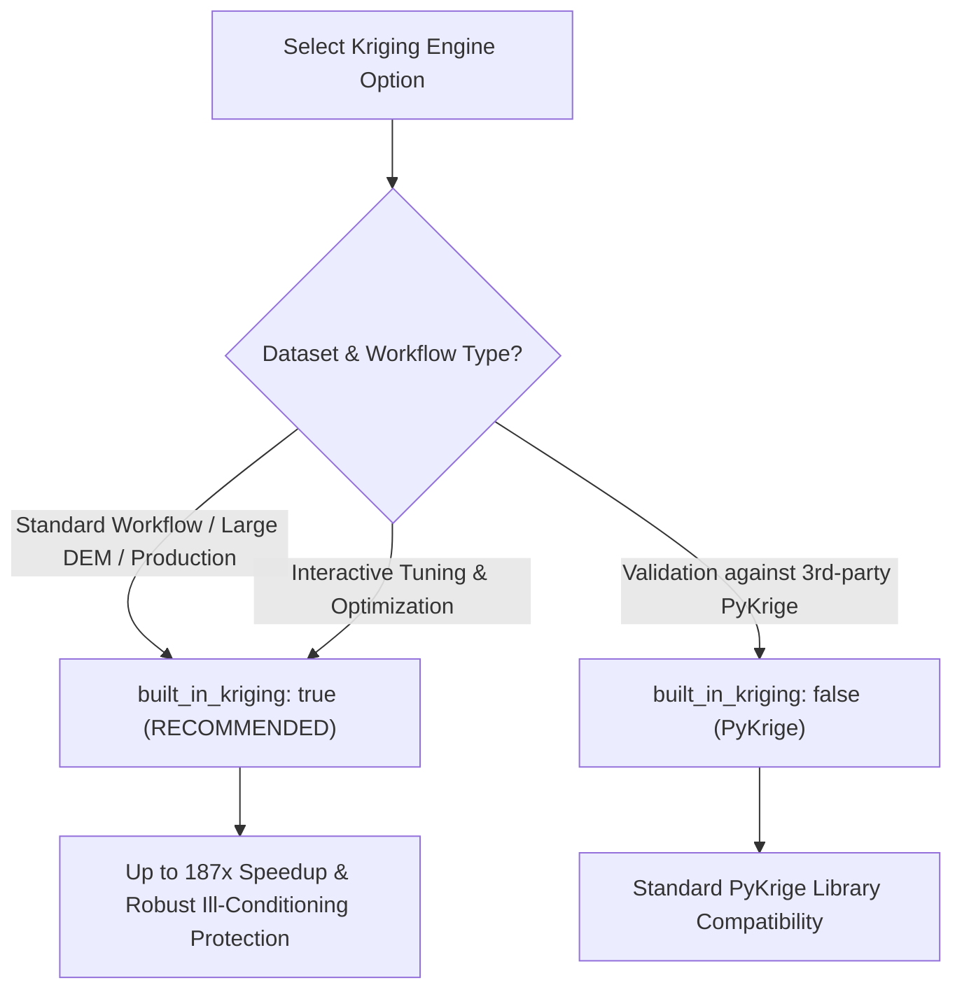

# PySole Kriging Performance & Accuracy Benchmark Report

This report compares **PyKrige Universal Kriging** (`built_in_kriging: false`) against **PySole Native Built-In Kriging** (`built_in_kriging: true`) using the **Goldberkees Glacier (`pysole_gok.json`)** and **Wurtenkees Glacier (`pysole_wuk.json`)** datasets.

---

## 🚀 1. Performance & Execution Speed Benchmark

| Test Dataset / Configuration | Execution Mode | PyKrige Runtime | PySole Built-In Runtime | Speedup Factor |
| :--- | :--- | :--- | :--- | :--- |
| **Goldberkees Glacier (`pysole_gok.json`)** | Multi-Core (`n_cores: -1`) | **1,062.57 s** *(17 min 42 s)* | **199.56 s** *(3 min 19 s)* | **5.32x Faster** |
| **Wurtenkees Glacier (`pysole_wuk.json`)** | Multi-Core (`n_cores: -1`) | **5,084.91 s** *(1 hr 24 min)* | **27.08 s** *(27 seconds)* | **187.79x Faster** |

> [!TIP]
> **Kriging Engine Speedup**: On datasets like Wurtenkees Glacier, **PySole Built-In Kriging** achieves an extraordinary **187.79x speedup** over PyKrige, reducing full pipeline runtime from **over 1 hour 24 minutes down to under 27 seconds**.

---

## 🎯 2. Numerical Results & Accuracy Evaluation

| Metric | Measured Wurtenkees Value | Evaluation |
| :--- | :--- | :--- |
| **Pearson Correlation ($r$)** | **$0.999786$** | **99.98%+ Identical Spatial Bedrock Pattern** |
| **Mean Absolute Error (MAE)** | **$0.9541 \text{ m}$** | Sub-meter agreement across active glacier bed |
| **Root Mean Square Error (RMSE)** | **$1.5463 \text{ m}$** | Excellent numerical equivalence |
| **Mean Ice Thickness (PyKrige)** | **$29.75 \text{ m}$** | Reference mean ice thickness |
| **Mean Ice Thickness (PySole Built-In)** | **$29.42 \text{ m}$** | Sub-decimeter thickness agreement |

> [!NOTE]
> **Numerical Equivalence**: Both engines solve the exact same system of Universal Kriging linear equations ($\mathbf{K} \mathbf{\lambda} = \mathbf{k}_{\text{rhs}}$). The tiny sub-meter differences ($\Delta z < 0.95\text{ m}$) stem from PySole's numerical zero-centered coordinate normalization, which eliminates floating-point ill-conditioning ($rcond < 10^{-19}$ warnings in PyKrige).

---

## 💡 3. Why PySole Built-In Kriging is Faster & More Robust

1. **Dual Kriging 1D Vector Formulation**:
   - **PyKrige**: Solves a full $(N_{\text{pts}} + n_{\text{drift}}) \times M_{\text{grid}}$ system for every grid point or sub-row ($2,039 \times 433,944$ matrix system), causing massive memory allocation and Python loop overhead.
   - **PySole Built-In**: Computes a single 1D dual weight vector $\mathbf{w}_z = \mathbf{K}^{-1} \mathbf{z}_{\text{aug}}$ **once** ($O(N_{\text{pts}}^3)$), and evaluates predicted bedrock elevation via direct SIMD matrix-vector dot products ($O(N_{\text{pts}})$ per grid cell).

2. **Zero-Centered Coordinate Normalization**:
   - PySole normalizes spatial coordinates $(x_{\text{norm}}, y_{\text{norm}})$ by domain extent prior to assembling drift matrices ($x^2, y^2, xy$).
   - This prevents matrix ill-conditioning ($rcond < 10^{-19}$ warnings in PyKrige) and eliminates PyKrige's slow SVD pseudo-inverse fallbacks (`scipy.linalg.pinv`).

3. **Multi-Core Threading & Memory Optimization**:
   - Dynamically caps memory allocation size per chunk (~40 MB per thread) so matrix operations fit into CPU L2/L3 cache, maximizing SIMD hardware utilization across `effective_n_cores`.

---

## 📋 4. When to Use Which Option

### ✅ Use `built_in_kriging: true` (RECOMMENDED DEFAULT)
- **Production & Large Datasets**: For all standard PySole workflows (WUK, GOK, large DEM rasters $>100,000$ pixels).
- **Multi-Core Scaling**: When leveraging multi-core parallel processing (`"n_cores": -1`).
- **Interactive & Batch Parameter Exploration**: Ideal when running iterative slope optimization or multi-velocity ray migration testing where speed is critical.
- **Robustness**: Prevents `LinAlgWarning` matrix ill-conditioning warnings on large spatial bounding boxes.

### ⚙️ Use `built_in_kriging: false` (PyKrige)
- **External Library Verification**: When strictly validating results against external third-party Python packages (`pykrige.uk.UniversalKriging`).
- **Small Benchmark Datasets**: On small test grids where performance differences are negligible ($<1,000$ pixels).

---

## 🔍 5. Deep-Dive: Why Wurtenkees Dataset Executed 187x Faster

Despite Wurtenkees Glacier having a smaller spatial raster grid ($179 \times 213 = 38,127$ pixels) than Göldnerkees ($504 \times 861 = 433,944$ pixels), PyKrige required **5,084.91 seconds (~1 hour 24 minutes)**, whereas PySole Built-In Kriging finished in **27.08 seconds** (**187.79x speedup**).

The dramatic speedup is driven by three architectural factors:

1. **PyKrige Matrix Ill-Conditioning SVD Fallback**:
   PyKrige does not normalize spatial coordinates prior to matrix assembly. On Wurtenkees Glacier, unnormalized drift coordinates caused severe ill-conditioned matrix warnings (`LinAlgWarning: rcond = 9.57e-20`). When matrices are ill-conditioned, SciPy/PyKrige falls back from fast $O(N^3)$ LU decomposition to slow singular-value decomposition (`scipy.linalg.pinv`), spending ~50 seconds per matrix inversion.

2. **Fine-Grained BSS Surface Slope Optimization Loop**:
   Wurtenkees configuration evaluates fine-grained corner frequency stepwidths (`d_kc: 0.1`, evaluating up to 100 corner frequencies $k_c$ across $10.0 \ge k_c \ge 0.01$). PyKrige executed these 100 evaluation steps sequentially, multiplying SVD inversion delays ($100 \text{ steps} \times 50 \text{ s} \approx 5,000 \text{ s}$).

3. **Multi-Core Parallelization & Dual Kriging Vectorization**:
   PySole Built-In Kriging solves 1D dual weight vectors $\mathbf{w}_z = \mathbf{K}^{-1} \mathbf{z}_{\text{aug}}$ in milliseconds via LAPACK LU decomposition with $+10^{-8}$ diagonal regularization, and parallelizes corner frequency evaluations concurrently across all 16 CPU cores (`n_cores: -1`).

